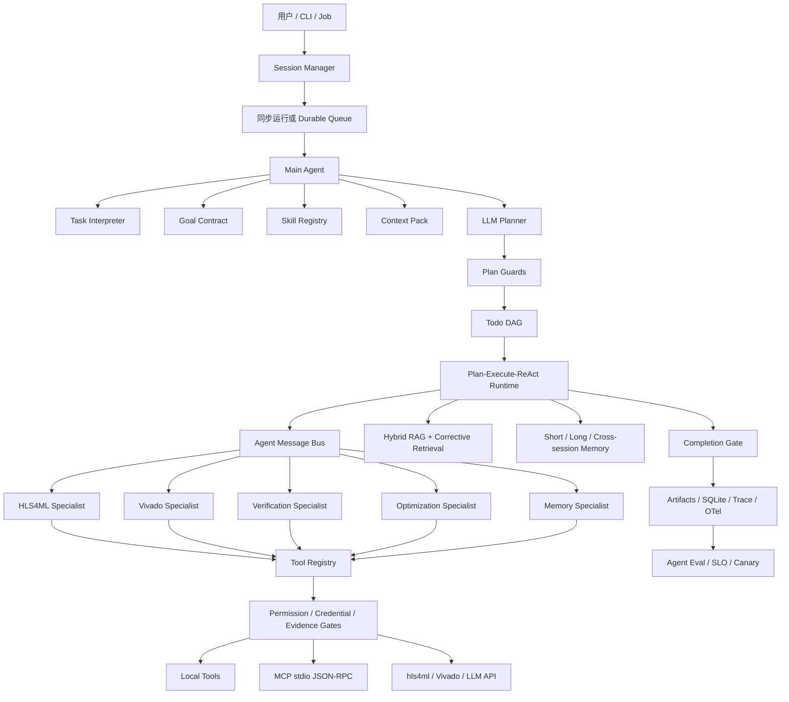
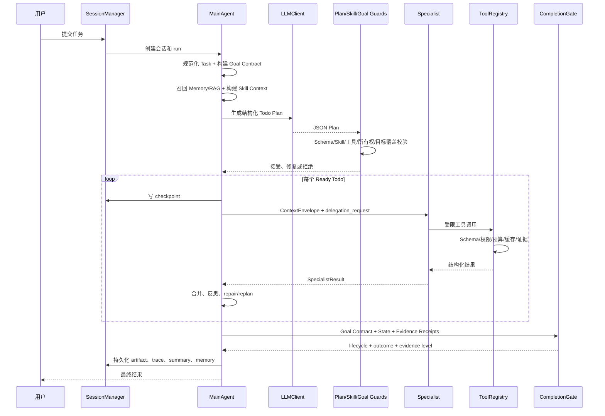
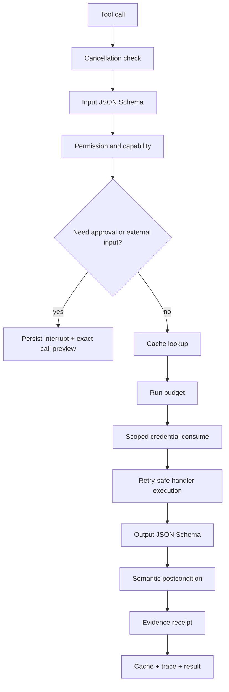
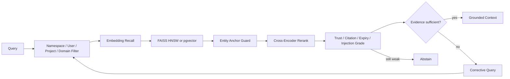
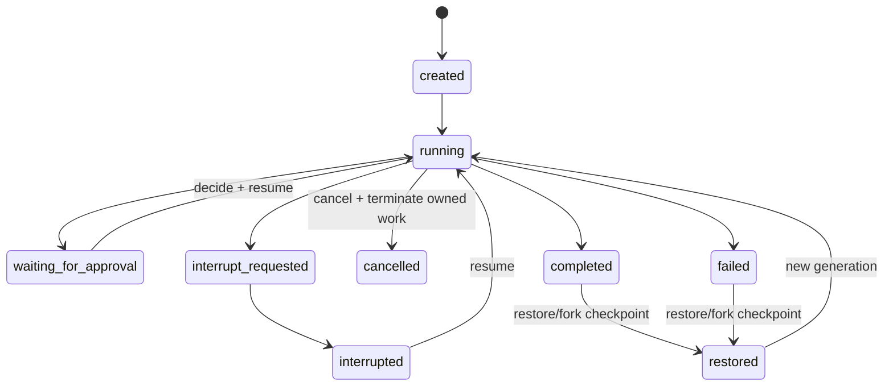
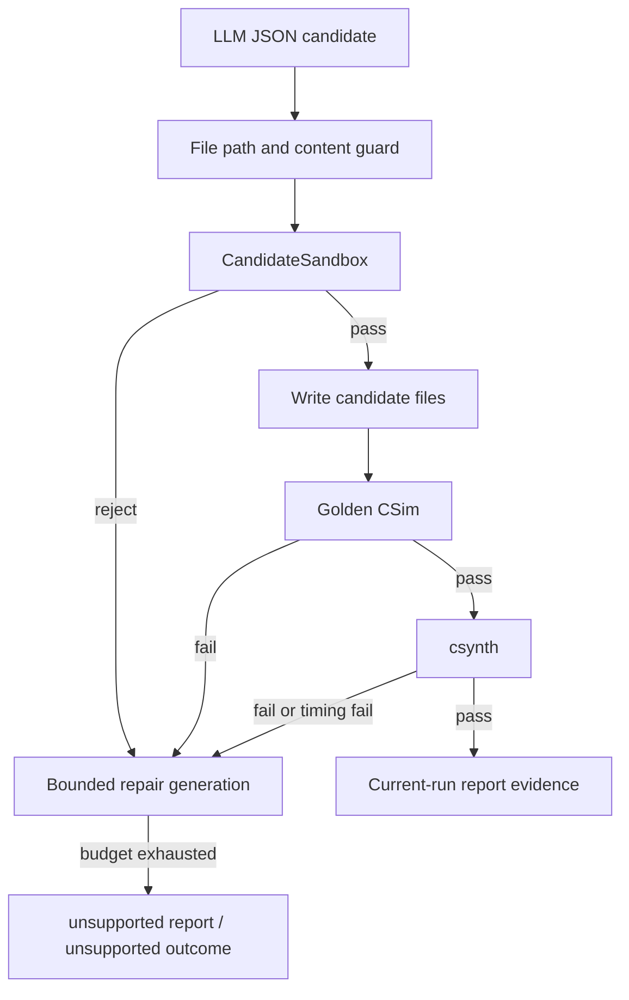

# DL-Operator-to-HLS Agent 完整设计与实现指南

> 本文是一份从零开始、可独立阅读的系统说明。它不要求读者预先阅读仓库中的其他文档，也不把 FPGA/HLS 知识当成理解前提。HLS 是 Agent 操作的真实复杂环境，本文真正讨论的是 LLM Agent Harness：模型如何规划，主 Agent 如何调度 Sub Agent，工具如何受控执行，系统如何管理上下文、记忆、RAG、会话、恢复、权限、证据、成本、发布和评测，以及各种 Bad Case 为什么会发生、如何被运行时门禁处理。

## 阅读路线

初次接触 Agent 的读者可以按以下四段阅读：

1. **建立全局认识**：第 1-5 章，先理解项目边界、总体架构、完整生命周期和停止条件。
2. **理解核心实现**：第 6-17 章，依次理解 LLM、Todo、Main/Sub Agent、Tool、Skill、Context、Memory、RAG、Session、Queue、安全和外部工具链。
3. **理解可靠性**：第 18-21 章，重点阅读 Bad Case、证据、可观测性、发布和评测。
4. **落到代码与实践**：第 22-32 章，通过例子、CLI、MCP、数据库、测试、真实问题和代码阅读顺序建立完整心智模型。

关键术语：

| 术语 | 本文中的含义 |
|---|---|
| Agent | 能根据任务规划、调用工具、观察结果、修复并判断完成的系统 |
| Harness | 包围 LLM 的确定性运行时，包括状态、权限、预算、证据、会话和评测 |
| Main Agent | 负责全局目标、计划、调度、合并和终止判断的控制器 |
| Specialist/Sub Agent | 由 Main Agent 调用的受限领域执行单元；只有需要独立语义决策时才使用自己的 LLM loop |
| Skill | 可版本化的领域执行契约，规定触发条件、Todo、工具、失败和预算策略 |
| Tool | 具有输入/输出 Schema、权限、风险、证据和执行策略的动作 |
| Todo DAG | 带依赖关系的执行任务图 |
| ReAct | 基于结构化状态、Action 和 Observation 决定下一步的循环；持久化决策摘要，不保存或要求模型暴露隐藏思维链 |
| Goal Contract | 从任务编译出的不可被 LLM 弱化的验收条件 |
| Evidence Receipt | 对工具输出、artifact 和 semantic postcondition 的可审计记录；除非有签名或可信执行环境，否则不是密码学证明 |
| Completion Gate | 不依赖 LLM 自我声明、独立计算最终状态的门禁 |
| Memory | 历史信息的写入、生命周期、隔离、晋升和遗忘体系 |
| RAG | 从受控语料中召回、重排、分级并提供证据的读取体系 |
| Bad Case | Agent 早停、越权、循环、跑偏、假成功、污染等异常行为 |

---

## 0. 文档口径与现代 Harness 基线

本文区分三种成熟度，避免把“设计上合理”写成“生产上已经完成”：

| 标记 | 含义 |
|---|---|
| **Implemented** | 仓库已有代码和测试覆盖 |
| **Local-grade** | 本机或单租户语义成立，但不具备多机 HA、企业身份或完整隔离 |
| **Production target** | 现代生产 Harness 应满足，当前仓库只定义接口或明确列为缺口 |

本文采用的现代基线不是某个框架的 API 形状，而是几个稳定原则：

1. **Agent loop 与 durable workflow 分离**：模型决定开放语义，运行时管理 turn、工具、暂停、恢复和停止；长程任务在 durable boundary 保存状态。
2. **会话、运行和结果正交**：thread/session 是交互容器，run/attempt 是一次执行，lifecycle 表示运行位置，outcome 表示目标结果，evidence level 表示证据强度。
3. **编排模式显式**：区分 manager-as-tools、handoff 和 deterministic workflow。本项目使用 manager-as-tools，Main Agent 始终拥有最终答案和全局门禁。
4. **所有外部输入不可信**：用户内容、模型输出、RAG 文本、MCP metadata、工具 stdout 和生成代码都必须经过相应边界校验。
5. **HITL 是可恢复中断**：审批、补充输入、用户暂停和取消是不同状态；审批必须绑定具体 tool call，并在执行前原子消费。
6. **副作用按至少一次执行设计**：持久化状态可以幂等提交，但外部副作用必须使用 idempotency key、reconciliation 或补偿动作，不能笼统声称 exactly-once。
7. **可观测但默认不泄密**：trace 关联 run、agent、tool、conversation 和 token 使用；Prompt、检索文本、工具参数默认脱敏或不导出。
8. **评测驱动发布**：离线回归、对抗评测、真实工具验证和线上 SLI 分层；发布 bundle 覆盖所有会改变行为的组件，而不只模型。

这些原则与 [OpenAI Agents SDK 的 agent loop、tools、handoffs、guardrails、sessions、HITL 和 tracing](https://openai.github.io/openai-agents-python/)、[LangGraph 的 thread/checkpoint persistence](https://docs.langchain.com/oss/python/langgraph/persistence)、[MCP 2025-11-25 规范](https://modelcontextprotocol.io/specification/2025-11-25/basic)以及 [OpenTelemetry GenAI 语义约定](https://opentelemetry.io/docs/specs/semconv/gen-ai/)保持一致。引用这些项目是为了说明范式，不表示当前仓库已经实现其全部能力。

---

## 1. 先建立正确的理解

### 1.1 这个项目是什么

这个项目接收模型、算子、已有 HLS 工程或自然语言任务，将任务解释为结构化目标，由 LLM 选择 Skill、生成 Todo DAG，再由 Main Agent 调度领域 Specialist 和工具，最终产出实现、验证、综合报告、优化建议、执行轨迹和记忆。

一句话概括：

> 这是一个以 HLS 工具链为真实外部环境、以 LLM 规划和受控执行为核心、具有会话恢复、证据门禁、RAG/Memory、权限治理和 Agent 评测能力的垂直领域 Agent Harness。

HLS 不是本文的主角。它的价值在于提供了一个足够真实的 Agent 场景：外部工具安装可能缺失，转换可能失败，生成代码可能能编译但功能错误，综合报告是半结构化文本，单次运行可能持续很久，而且错误必须被诚实表达。

### 1.2 它为什么不是普通脚本

普通工作流通常是固定的 `A -> B -> C`。本系统额外具备以下 Agent 特征：

1. LLM 根据任务和 Skill 动态选择路径并生成计划。
2. 计划不是直接执行，而是经过 Schema、Skill、权限、目标覆盖和 Specialist 所有权校验。
3. 运行时根据工具结果进行反思、修复、重规划、降级或终止。
4. Main Agent 与 Specialist 有明确职责、上下文和工具能力边界。
5. 会话可以中断、恢复、checkpoint restore/time travel 和撤回消息。
6. 历史经验通过 Memory 和 RAG 被选择性召回，并有污染控制。
7. 工具声明成功不等于系统相信成功；还要通过 semantic postcondition 和 evidence receipt。
8. 最终状态由独立 Completion Gate 判定，而不是由 LLM 自己宣布。
9. 行为 release bundle 有版本、灰度和自动路由回退机制；当前先覆盖模型、Prompt 和 Skill。
10. Agent 质量由路径选择、任务完成、诚实性、修复、轨迹、RAG、成本等指标评估。

### 1.3 Agent 与 Harness 的职责分界

成熟 Agent 的关键不是“让模型思考得更多”，而是把不同性质的问题放在正确层：

| 层 | 负责什么 | 不应该负责什么 |
|---|---|---|
| LLM | 语义理解、Skill 选择、计划、局部决策、失败反思 | 权限最终裁决、真实性认定、资源锁、状态提交 |
| Main Agent | 生命周期、全局调度、合并结果、停止判断 | 绕过委派协议直接调用 Specialist 专属工具 |
| Specialist | 在受限领域内执行和总结 | 读取全量上下文、越权调用其他领域工具 |
| Harness | Schema、权限、预算、状态机、证据、重试、缓存、会话、可观测性 | 代替 LLM 进行开放语义理解 |
| Tool/Adapter | 与外部系统交互并返回结构化结果 | 决定整个任务是否完成 |
| Completion Gate | 根据任务契约和证据决定最终状态 | 相信自然语言“已经完成” |

这也是系统最核心的设计思想：**Prompt 表达意图，代码门禁执行约束。**

---

## 2. 项目边界与状态语义

### 2.1 支持的任务类型

当前主要任务输入有三类：

| `task_type` | 例子 | 目标路径 |
|---|---|---|
| `model` | MNIST MLP ONNX | `hls4ml_path` |
| `operator` | Dense、MatMul、ReLU、Add | `fallback_template_path` 或 `llm_candidate_path` |
| `hls_project` | 已有 C/C++ HLS 工程 | `existing_hls_project_path` |

无法完成或不建议继续的输入进入 `unsupported_path`。该路径不是“失败掩盖”，而是一个有报告、有原因、有下一步建议的诚实边界。

### 2.2 状态必须拆成三个维度

现代 Harness 不应把“运行在哪里”“任务结果是什么”“证据有多强”塞进同一个 `status`：

| 维度 | 典型值 | 含义 |
|---|---|---|
| `lifecycle` | `created/queued/running/waiting_for_approval/interrupted/completed/failed/cancelled` | 调度和恢复状态 |
| `outcome` | `success/partial_success/unsupported/failed` | 用户目标的结果 |
| `evidence_level` | `real/mock/missing` | 支持结论的证据等级 |

`waiting_for_approval` 与用户主动 `interrupt_requested` 已在 Session 层分开。`unsupported` 应当是独立 outcome：它表示 Agent 正确识别能力边界，但用户目标没有完成；只有确实交付了有用子结果时才使用 `partial_success`。当前部分 `AgentState.status` 和旧 benchmark 为兼容历史数据仍把 honest unsupported 映射为 `partial_success`，这是待迁移的序列化兼容层，不是推荐领域模型。

`interrupted`、`waiting_for_approval` 和 `cancelled` 不是任务质量结论。恢复或取消后，outcome 仍需由 Completion Gate 单独计算。“生成了代码”或“工具退出 0”都不是成功。

### 2.3 当前最可信的主场景

当前真实跑通并适合作为主线的是 MNIST MLP。其他算子、边界任务、工具链缺失和 LLM candidate 场景主要用于覆盖路由、恢复和诚实性。项目没有把有限样例的通过率描述为开放世界可靠性。

---

## 3. 总体架构



### 3.1 代码分层

| 层 | 主要目录 | 核心职责 |
|---|---|---|
| 入口与装配 | `src/dl_op_to_hls/cli.py`、`main_agent/agent.py` | 配置、依赖、工具、适配器、数据库初始化 |
| Agent Runtime | `main_agent/llm_runtime.py`、`main_agent/runtime.py` | LLM-first 生命周期、Todo 执行、反思、恢复、完成 |
| LLM | `llm/` | Client、Prompt、Schema、Planner、ReAct、Reflector、Guard |
| Specialist | `specialists/` | 领域 Sub Agent、上下文裁剪、局部 ReAct、统一结果 |
| Tool Harness | `core/tool_registry.py`、`core/tool_evidence.py` | 工具契约、权限、预算、缓存、重试、证据 |
| Skill | `skills/`、仓库根目录 `skills/*.yaml` | 可版本化领域流程、工具和预算约束 |
| Context | `core/context_pack.py`、`workspace_context.py` | 多文件索引、检索、压缩和 token ledger |
| Memory/RAG | `memory/`、`rag/` | 记忆分层、语义检索、重排、证据分级、污染控制 |
| Session/Queue | `core/sessions.py`、`durable_queue.py` | 暂停、审批等待、恢复、checkpoint restore、撤回、多 Worker 幂等状态提交 |
| 安全 | `permissions.py`、`execution_sandbox.py`、`credential_broker.py` | 能力、路径、命令、网络、容器和短期凭证 |
| 可观测性 | `trace.py`、`hooks.py`、`observability.py` | 审计轨迹、事件、OTel span 和 SLO |
| 评测 | `benchmarks/`、`src/dl_op_to_hls/benchmarks/` | Agent 指标、Bad Case、RAG、成熟度和真实 LLM 评测 |

---

## 4. 一次完整运行如何发生

### 4.1 生命周期总览



### 4.2 初始化

`MainAgent` 在构造时完成以下装配：

1. 从 `runtime.yaml`、环境变量和 `permissions.yaml` 加载配置。
2. 初始化 SQLite schema 和 Repository。
3. 创建 Durable Queue、ReleaseManager、CredentialBroker。
4. 创建 RAG、Memory、Session 和 WorkspaceContext。
5. 创建本地 ToolRegistry，或根据环境切换为 MCP stdio proxy。
6. 加载并验证 Skill。
7. 注册模型、Prompt 和 Skill release baseline。
8. 初始化 hls4ml、Vivado 和 LLM adapter。

每次 run 由 `create_run_context()` 创建独立目录、ArtifactManager、TraceWriter、HookManager、RunBudget、Scheduler、CancellationToken、MessageBus 和 evidence receipt 容器。

### 4.3 LLM-first 外层流程

`LLMFirstRuntime.run()` 的主流程是：

```text
create session
  -> initialize task/state/governance
  -> ensure LLM enabled
  -> retrieve initial memory
  -> build skill context
  -> LLM plan
  -> validate/repair plan
  -> checkpoint
  -> execute Todo DAG with checkpointed boundaries
  -> finalize artifacts/memory/report
  -> Completion Gate
  -> close run/session
```

系统没有在真实 LLM 失败时静默退回旧的确定性工作流。`runtime.llm.fallback: error` 表示 LLM-first 模式下，模型不可用就是可见的结构化错误。若产品模式允许降级，降级路径也必须作为显式 policy 和 trace event 存在，评测时与 LLM 路径分桶，不能悄悄替换被测系统。

### 4.4 为什么仍保留确定性组件

“LLM-first”不等于“所有步骤都调用 LLM”。已经由计划明确的原子工具调用和 Specialist 委派会自动执行，避免每个 Todo 再请求一次模型。LLM 用在开放语义决策上，确定性代码用于状态机、治理和已确定动作。这是性能优化，也是可靠性设计。

---

## 5. Task、Goal Contract 与停止条件

### 5.1 Task Schema

任务包含名称、类型、输入模型或工程、前端、目标设备、时钟、优化目标、算子规格、LLM candidate 设置等字段。自然语言输入先由 Task Interpreter 转换为结构化 Task；JSON 文件直接加载并规范化。

### 5.2 Goal Contract

`GoalContractBuilder` 把 Task 编译为不能被 LLM 弱化的验收条件。每项条件应包含 `required`、`applicability`、verifier、证据类型和可选的授权 waiver；不适用与未满足必须分开。默认包括：

| Requirement | 验证逻辑 |
|---|---|
| `task.validated` | `task.validate_schema` 成功 |
| `implementation.resolved` | 有真实实现路径；unsupported report 只解释未满足原因 |
| `implementation.verified` | 功能验证通过；unsupported 时为 unmet/not-applicable，不伪装为通过 |
| `report.produced` | 当前 run 有综合报告；unsupported report 是另一种 artifact 类型 |
| `implementation.timing` | 时序满足；仅在任务明确不要求综合时才可判定 not-applicable |
| `run.summarized` | summary artifact 存在 |
| `run.no_unresolved_errors` | 没有未解决的关键错误 |

用户可增加 `acceptance_criteria`，但不能移除默认最低要求。

### 5.3 计划覆盖检查

`PlanCoverageValidator` 检查每个 `plan_required` requirement 是否至少被一个 Todo 的工具覆盖。若 LLM 漏掉验证或报告步骤，运行时会从已选 Skill 的 `recommended_todos` 中有界补齐，然后重新检查。

这种机制解决了常见 Bad Case：LLM 给出一份语言上合理、执行上不完整的计划。例如只生成代码和总结，却没有验证或报告 Todo。

### 5.4 Completion Gate

Completion Gate 独立于 Planner、Reflector 和 LLM。它检查 state、artifact、report、verification 和 evidence receipt，重新计算最终状态。

关键规则：

1. LLM 说“完成”不构成证据。
2. 工具返回 `success` 但 semantic postcondition 失败，不构成证据。
3. mock 结果可支持 Harness 契约测试，但不能支持 production-ready 声明。
4. unsupported 形成独立 `unsupported` outcome；只有交付了有意义子结果时才可描述 partial deliverables，且不能带伪造综合指标。
5. 之前状态是 `success`，但证据不完整时，会记录 `false_success_prevented`。

这正面解决了“Agent 是否完成任务才停下”“是否偷懒早停”的问题。

---

## 6. LLM 层设计

### 6.1 模型接入

当前默认配置使用 OpenAI-compatible Chat Completions 协议：

```yaml
provider: openai-compatible
base_url: https://api.deepseek.com
model: deepseek-v4-pro
```

密钥只从 `DL_OP_TO_HLS_LLM_API_KEY` 环境变量读取，不应进入配置、state、trace 或文档。`PermissionGate` 还会校验 base URL 域名是否在网络 allowlist 中。

### 6.2 结构化输出

Task Interpretation、Todo Plan、Main ReAct、Specialist ReAct、Reflection、Optimization 和 Candidate Generation 都有 JSON Schema。现代优先级是：provider 原生 structured output/tool call > 严格 JSON Schema > 兼容性 JSON 提取。`LLMClient.complete_json()` 当前执行：

1. 请求 JSON response format。
2. 解析纯 JSON、Markdown fenced JSON 或文本中的 JSON object。
3. 归一化少量常见字段缺失。
4. 校验 required 字段。
5. 若解析或校验失败，触发一次受控 JSON repair 请求。
6. repair 仍失败则产生 `LLMGenerationError` 和脱敏 debug artifact。

真实 DeepSeek smoke 中出现过一次 JSON repair，最终计划被接受。repair 后仍必须重新执行完整 Schema、权限和目标覆盖校验；不能因为是“修复响应”而降低标准。

运行时只保存模型的结构化决策、简短 rationale summary 和必要 usage，不要求、记录或评测隐藏 chain-of-thought。

### 6.3 请求控制

LLM Client 实现了：

- 单 run LLM call 和 token 上限；
- request bytes/min 限流；
- 最小请求间隔；
- 429、5xx 指数退避；
- `Retry-After` 和自适应 cooldown；
- usage token 记录；
- reasoning content 没有 final content 时的一次 finalization retry；
- Prompt、响应和 debug artifact 中的 key/token 脱敏。

### 6.4 LLM 负责哪些决策

1. 自然语言到结构化 Task。
2. 从候选 Skills 中选择一个执行契约。
3. 生成 Todo Plan。
4. 对无法由计划直接确定的 Todo 做 ReAct。
5. 对失败结果做 Reflection，提出受控新 Todo。
6. 生成候选 HLS 文件或优化建议。

已确定的 Specialist 委派和原子工具调用不重复调用 LLM，分别记录为 `LLMReActAutoDelegated` 和 `LLMReActAutoDirect`。

---

## 7. 计划、Todo DAG 与 ReAct

### 7.1 Todo 数据结构

一个 Todo 包含：

```text
id / title / description / status / priority
dependencies
assigned_tool / assigned_specialist
inputs / outputs / error
context_scope
react_steps
specialist_result
requirement_ids
timestamps
```

Todo 状态包括 `pending`、`in_progress`、`completed`、`completed_with_warning`、`failed`、`blocked`、`skipped`、`cancelled`。

### 7.2 DAG 规范化

LLM 可以提出任务特定的 Todo 和依赖，但运行时会投影到合法 DAG：

```text
validate
  -> inspect/support
  -> graph rewrite / config / fallback / existing project
  -> create project
  -> verification / csynth
  -> parse report
  -> optimization suggestions
  -> summary
  -> memory promotion
```

系统只对语义无歧义的问题做确定性修复，例如补全明确的 Specialist owner。未知依赖、自依赖、环或会改变任务含义的修改应拒绝并触发 bounded plan repair，而不是静默删除。最终ization 顺序可按可信 Skill 约束规范化为 `suggestion -> summary -> memory`。

### 7.3 Main ReAct

Main ReAct 的动作集合是：

- `delegate_to_specialist`
- `direct_tool_only_when_no_specialist`
- `request_replan`
- `mark_blocked`
- `mark_failed`

模型不能在 Main Agent 中直接调用 Specialist 私有工具。若 Todo 已声明 Specialist，Main Agent 直接委派；若 Todo 是无 Specialist 的原子工具，直接调用；仅在动作不明确时才请求 LLM ReAct。

### 7.4 Reflection

工具或 Specialist 返回 warning/failure 后，Reflection 可以改变 Todo 和 run 状态、增加新 Todo、产生 memory candidate。所有新 Todo 仍要经过工具存在性、Specialist 存在性、Skill allowlist 和 Specialist tool ownership 校验。

### 7.5 防循环和跑偏

`ProgressSupervisor` 持续观察：

- 总 step 是否超过 64；
- state hash 是否连续不变；
- 同一工具、错误、输入组合是否重复失败；
- Todo 是否没有映射到 Goal Requirement；
- 是否连续向目标无关方向漂移。

默认同类问题重复 2 次建议 replan，3 次终止；还会记录 `review`、`replan` 或 `terminate` 原因。它不是 Prompt 建议，而是独立运行时监督器。

---

## 8. Main Agent 与 Specialist Agents

### 8.1 编排模式：Manager-as-tools

拆分不是为了增加“多 Agent”噱头。本项目采用 manager-as-tools：Main Agent 保留会话和最终答案所有权，Specialist 像受限工具一样返回结构化结果，而不是接管用户对话。它解决三个工程问题：

1. **权限最小化**：每个 Specialist 只看到自己的工具。
2. **上下文隔离**：只接收任务相关状态和 artifact refs。
3. **职责清晰**：Main Agent 聚焦全局控制，Specialist 聚焦领域执行。

若某个步骤只需确定性解析或执行，应实现为 Tool，不应为了“多 Agent”而额外调用模型。只有需要独立指令、局部上下文和多步语义决策时，Specialist 才是 Agent。真正的 handoff 适合让 Specialist 接管后续对话，本项目当前不使用该模式。

### 8.2 Specialist 一览

| Specialist | 职责 | 典型工具 |
|---|---|---|
| `HLS4MLSpecialist` | 模型检查、支持性、配置、转换、hls4ml CSim | `hls4ml.*` |
| `VivadoSpecialist` | 工程创建、CSim、csynth、报告和日志解析 | `vivado.*` |
| `VerificationSpecialist` | testbench、candidate 功能验证、验证门禁 | `verify.*`、有限 Vivado 工具 |
| `OptimizationSpecialist` | 从报告和受控历史经验生成建议 | RAG、optimization memory、suggestion |
| `MemorySpecialist` | 压缩、候选提取、长期记忆晋升、RAG 索引 | `memory.*`、`rag.index_artifact` |

### 8.3 通信协议

Main Agent 发送 `delegation_request`，内容包括 run、Todo、工具、依赖和经过裁剪的 ContextEnvelope。Specialist 返回 `SpecialistResult`，Main Agent 再写 `delegation_result`。请求和结果用 `correlation_id`、`parent_message_id` 配对。

`agent_delegation_messages` 数据库表是权威 delegation log，序号在事务内分配；`agent_messages.jsonl` 只是可重建 artifact projection。当前 Specialist 在同一进程内同步调用，因此该 log 用于恢复、审计和评测，不被夸大为分布式消息 broker。未来异步 Specialist 应通过 durable queue/outbox 传递，并校验 lease owner、attempt 和幂等键。

统一 `SpecialistResult` 包含：

```text
specialist_name / todo_id / status / summary
observations / metrics / artifacts
errors / warnings / suggested_todos
memory_candidates / verification / context_usage
```

Main Agent 不需要理解 Specialist 的内部实现，但必须验证返回 Schema、Todo/correlation 归属、artifact provenance、权限和 evidence；统一协议不等于默认信任结果。

### 8.4 Specialist 本地 ReAct

每个 Specialist 有自己的局部 ReAct，但默认优先确定性执行。只有工具不明确、已有失败观察或明确启用 adaptive LLM 模式时，才使用本地 LLM decider。这样既保留 Agent 自主性，又避免每一步都消耗 token。

### 8.5 能力隔离

Specialist 调用工具时，运行时创建 principal：

```json
{
  "type": "specialist",
  "id": "VivadoSpecialist",
  "capabilities": ["hls.inspect", "hls.execute"]
}
```

一次调用必须同时满足：Todo allowed tool、Specialist allowed tool、ToolSpec required capability、PermissionGate policy。只满足其中一层仍不能执行。

---

## 9. Tool Harness

### 9.1 ToolSpec

每个工具注册为 `ToolSpec`：

```text
name / description
input_schema / output_schema
permission_level / required_capabilities / risk_level
idempotent / cacheable / parallel_safe / max_retries
timeout_seconds / network_domains
credential_audience / credential_scope
handler / server / tags
```

当前 `ToolSpec` 还没有 first-class `version` 字段，实际通过代码/release 环境隐式固定；把 tool version、Schema hash 和 adapter version 纳入 manifest 是 Production target，而不是已完成能力。

当前 Registry 有 52 个注册名称，其中 41 个 canonical tools、11 个兼容 aliases。Planner 只接收 canonical tool catalog；alias 在 Registry 内解析到 canonical ToolSpec 后执行，继承同一权限、capability、缓存、重试、凭证和证据策略，不能作为旧名称绕过治理。

输入/输出优先使用严格 JSON Schema，能够封闭的 object 应设置 `additionalProperties: false`。工具描述、MCP annotation 和动态 server metadata 均视为不可信数据，不能覆盖本地 risk、capability 或 approval policy。

这使工具不再是“一个 Python 函数”，而是可治理、可评测、可审计的 Agent action。工具版本和 Schema hash 也应进入 release manifest，避免重试时同名工具语义漂移。

### 9.2 一次工具调用的门禁顺序



### 9.3 Schema 与错误

输入不符合 Schema 返回 `ToolSchemaError`，不会进入 handler。输出不符合 Schema 同样失败。异常被转换为结构化错误，包含：

```text
error_type / message / recoverable / source
suggested_action / details
```

这种结构使 Reflector 能区分 schema repair、toolchain recovery、verification repair 和不可恢复错误。模型和用户可见错误经过脱敏；内部诊断保留 correlation id，不回传 secret、敏感路径或未经裁剪的 stdout。

### 9.4 Semantic Postcondition

仅验证 JSON 结构不够。例如 `vivado.run_csynth` 返回了 `status=success`，但报告文件不存在。`ToolPostconditionRegistry` 对关键工具执行语义检查：

- 生成文件是否真的存在；
- artifact 是否属于当前 run，防止复用旧结果；
- CSim 是否通过 golden check；
- csynth report 是否存在；
- report 是否包含 latency/resources/timing；
- unsupported report 和 summary 是否真实落盘；
- 工具输出是否含已知 prompt injection marker。

失败时，原 `success` 会被改为 `ToolPostconditionError`。marker 检测只是启发式信号；根本防线是把工具内容作为 data 隔离、不给内容提升权限，并对最终动作和声明重新校验。

### 9.5 Evidence Receipt

每次工具调用生成 receipt：工具名、输入/输出 hash、检查项、artifact 路径/大小/SHA-256、是否 mock、观测时间。Completion Gate 消费 receipts，而不是重新相信自然语言摘要。

### 9.6 缓存、重试和去重

当前只对明确标记 `cacheable` 的工具按 `canonical tool name + normalized args hash` 做 run-local 缓存。每个 run 的 cache 存在自己的 context 中，且缓存查询前仍执行当前身份授权，因此不会跨 run/tenant 共享。将 tool version、dependency fingerprint 和显式 tenant scope 纳入跨 run 缓存键属于后续目标。仅 idempotent 工具允许自动重试；带副作用工具恢复时应先 reconciliation，再决定是否重放。

审批是 call-scoped capability：当前绑定 `session + canonical tool + normalized args hash + expiry/max uses`，且在创建审批前已完成 principal/capability 检查，并在 handler 前原子消费。若消费失败，工具必须保持阻塞。把 principal identity 和 tool version 直接固化进审批记录仍是进一步加固项。

---

## 10. Skills

### 10.1 Skill 的定位

Skill 是可版本化的领域执行契约，不是长 Prompt。它定义：

```text
name / version / status / description / intent
trigger / preconditions / recommended_todos
allowed_tools / allowed_specialists
failure_policy / verification_policy / memory_policy
budget_policy / concurrency_policy / permissions
dependencies / integrity / tags
```

当前有 10 个 approved Skill：已有工程、hls4ml 模型、延迟优化、LLM candidate 验证、记忆晋升、算子 fallback、报告解析、资源优化、unsupported 边界和 Vivado 综合。

### 10.2 Skill 选择

`SkillRegistry.find_candidates()` 根据 task type、frontend、op type、安全条件 DSL 和 LLM candidate requirement 进行候选过滤和排序。精确主流程优先于横切 optimization/report/memory Skill，unsupported 和显式 LLM candidate 使用高优先级条件。最多 5 个候选被压缩后送入 Planner，由 LLM 最终选择。

### 10.3 安全条件 DSL

Skill trigger 不执行任意 Python `eval`，只支持 `eq`、`ne`、`in`、`contains`、`exists`、`has:path` 和代码中注册的有限命名谓词。未知命名谓词 fail closed，避免拼写错误把条件退化成无条件命中。这也避免 Skill 文件成为代码注入入口。

### 10.4 静态与运行时校验

Skill 加载时检查：

- 必需字段；
- stable name 和 semver；
- candidate/approved/deprecated 生命周期；
- Todo 是否有环或未知依赖；
- budget 是否为正；
- 最大并发不超过 8；
- 内容 SHA-256 完整性检查；
- dependency 是否存在。

执行前还检查工具和 Specialist 是否真实注册、Plan 是否超出 Skill allowlist。

### 10.5 版本与发布

普通 SHA-256 只能检测内容变化，不能证明发布者身份；若 Skill 来源不可信，必须使用签名 release、受保护 registry 或代码审查，而不是相信同目录中的 hash。每个 run 的 release manifest 固定 Skill 版本和内容 hash。恢复会话时继续使用原版本，不会因仓库更新而悄悄换 Skill。candidate Skill 可经过 Canary 评测后 promote 或 rollback。

---

## 11. 多文档、多代码文件与上下文压缩

### 11.1 为什么不能把仓库全塞进 Prompt

全量上下文会导致 token 成本、检索噪声、注意力稀释和权限泄露。系统采取“先索引、后检索、再按任务压缩”的方式。

### 11.2 WorkspaceContext

支持 Python、C/C++、Markdown、JSON、YAML、TCL 和文本文件。增量索引记录 SHA-256、大小、行数、语言和 symbol；未变文件复用 manifest，删除文件从 manifest 清除。

主要工具：

| 工具 | 用途 |
|---|---|
| `workspace.scan` | 增量扫描多文件 |
| `workspace.search` | 文本检索并返回上下文行 |
| `workspace.symbol_search` | 按 class/function/heading 检索 |
| `workspace.read_batch` | 一次读取多个有限行区间 |

Python symbol 使用 AST；C/C++ 用签名提取；Markdown 用标题。每个结果带 `path:Lstart-Lend` citation。读取路径仍受 PermissionGate 控制。

### 11.3 Context Pack

Planner/ReAct 上下文被组织为多个 `ContextBlock`：任务、约束、Skill、工具、Workspace、Memory、RAG、State、Observation。每块有 category、priority、pinned、source 和稳定 block id。

编译策略：

1. pinned 约束优先保留；
2. 内容 hash 去重；
3. 按优先级选择；
4. 根据 query 做句子级 extractive compression；
5. 超预算时丢弃低优先级块；
6. 输出 token ledger 和 dropped reason。

`ContextPackBuilt` 事件记录预算、估算 token、pinned token 和丢弃块。当前 token 计数是估算值；生产适配器应优先使用对应 provider/model tokenizer，并预留 output、tool schema 和重试余量。任何压缩都不能删除权限、用户验收条件、审批决定和当前错误等不可丢失约束。

Workspace、Memory、RAG 和工具输出以带来源标签的 **data block** 注入，不允许其中的“指令”改变 system policy、工具权限或 Goal Contract。模型仍可能受间接 Prompt Injection 影响，因此还需要最小化工具能力和输出后置校验，不能把关键字扫描当成完整防线。

### 11.4 ContextEnvelope

Specialist 不接收完整 AgentState，只接收：

- task summary；
- 当前 Todo；
- Specialist 特定 scoped state；
- artifact refs，而不是原始大文件；
- 最多 5 条 memory refs；
- allowed tools；
- max context tokens；
- 排除 raw logs、full trace、all memories、full code 和 raw report 的约束。

`ContextCompressionMeasured` 记录输入/输出估算 token、原始 artifact bytes、摘要 bytes 和 compression ratio。

### 11.5 会话压缩

数据库保留 append-preserving 消息账本，撤回通过状态和因果字段表达而不是物理删除；模型上下文只保留最近消息和由旧消息生成的派生 summary。`compaction_history` 记录输入 message id、摘要版本、模型/算法、ledger 和 source hash；原消息不会因压缩而删除。撤回或源消息变化会使相关摘要失效并重新生成。

摘要只能用于导航和对话连贯性，不能成为权限、审批、数值结果或验证结论的权威来源。关键事实必须回指结构化 state、artifact 或原始消息。当前实现使用 query-aware extractive ContextPack，摘要版本/失效图仍属于 production target。

---

## 12. Memory：短期、长期与跨会话

### 12.1 Memory 和 RAG 的区别

Memory 是“存什么、何时写、谁能看、何时遗忘”的生命周期系统；RAG 是“给定 query，如何从可检索语料中找证据”的读取系统。长期 Memory 可被索引进 RAG，但二者不是同一个概念。

### 12.2 分层

| 层 | 内容 | 生命周期 |
|---|---|---|
| 运行状态 | AgentState/Todo/Tool result | 当前 run，不当作长期记忆 |
| 短期记忆 | 每个 Todo 的状态、摘要、错误、路径 | thread/run state，由数据库 checkpoint 持久化；`short_term.json` 仅为 artifact projection |
| Episodic | 一次 run 的经过和结果 | 跨 run |
| Semantic | 验证过的事实、规则、参数经验 | 长期 |
| Procedural/Skill | 可复用执行步骤和成功条件 | 长期、需治理 |
| Conversation | 用户偏好和跨会话摘要 | 按 user/project 隔离 |

### 12.3 写入流程

```text
Todo observation
  -> short-term entry
  -> compress run context
  -> extract candidates
  -> sanitize
  -> MemoryPolicy classification
  -> confidence / verification gate
  -> deduplicate by content hash
  -> SQLite long-term memory
  -> optional RAG indexing
```

### 12.4 晋升条件

只有功能验证和综合证据满足策略时，才产生高可信 `verified_implementation`、`parameter_experience` 和 optimization memory。只有综合成功但没有功能验证时，记为低置信 `synthesis_success`，不能伪装成已验证实现。时序失败会分别记录 failure 和 optimization guidance。

长期记忆写入发生在证据和 Completion Gate 之后，候选与已晋升记忆分表或分状态保存；当前 run 不应立即召回自己刚写入、尚未验证的候选，避免自我强化。所有召回记忆都作为不可信数据而非指令。

### 12.5 命名空间和隔离

Memory 带 namespace、user_id、project_id、session_id、source run、confidence、importance、hash、访问次数、反馈分数、过期和删除状态。身份来自认证上下文，不接受模型或请求 payload 自报；跨会话召回必须匹配身份边界，删除/撤权要同步到 lexical、vector 和 cache 层。评测覆盖 user isolation，但当前本地 `local-user` 不是企业认证实现。

### 12.6 Failure-query gating

失败经验容易污染正常优化任务。系统只有在 query 含 `failed`、`error`、`missing`、`unsupported`、`VivadoNotFoundError` 等 failure anchor 时才召回 failure memory。普通优化 query 会对带错误的 `partial_success/failed` 经验降权。

还会提取 Dense、MatMul、MLP、ResNet18 等 task-family anchor；如果 query 和历史来源属于不同 family，会额外降权或拒绝。

### 12.7 在线反馈防污染

用户反馈不直接改 memory score，而先进入 `FeedbackGovernor`：

- `pending`：等待证据或人工审核；
- `quarantined`：命中 prompt injection、跨租户来源、异常高分、artifact hash 不一致；
- `approved`：可应用；
- `rejected`：不应用；
- `revoked`：撤回并重算聚合分数。

只有有 verified run evidence 的反馈可自动批准。反馈文本本身不会被直接索引进 RAG，防止二次 prompt injection。

### 12.8 遗忘与纠错

Memory 支持 feedback、forget、cleanup、supersedes、过期和 revoke。错误记忆不应该靠“再写一条正确内容”来掩盖，而要可定位、可撤回、可重算。

---

## 13. RAG：召回、重排、证据与纠错

### 13.1 完整检索链路



### 13.2 索引

文本按 chunk size 和 overlap 切块，保存 source、行号、metadata、ACL/namespace、版本和 provenance。SQLite FTS5 提供 lexical 检索；`rag_embeddings` 持久化向量和 content hash。删除、权限变化和文档更新必须通过 tombstone/version 使 FTS、ANN、reranker cache 同步失效；权限过滤失败时 fail closed。

### 13.3 Embedding Recall

默认模型为 `sentence-transformers/all-MiniLM-L6-v2`。文档向量批量编码并复用 SQLite 缓存；query 向量使用 LRU cache。在线最多补 64 个缺失 embedding，避免一次请求触发全库迁移。

### 13.4 FAISS HNSW

达到 `ann_min_rows=256` 后使用持久化 `IndexHNSWFlat + IndexIDMap2`：

- 向量 L2 normalize 后做 cosine/inner product；
- SQLite chunk id 作为稳定 vector id；
- manifest 绑定模型、内容 hash、维度和参数；
- signature 不匹配自动 rebuild；
- ANN 先 overfetch，再与权限过滤后的 row id 相交。

`PgVectorIndex` 提供外部 PostgreSQL 边界，但仓库未内置真实 pgvector 集群、连接池、RLS 和迁移。

### 13.5 Cross-Encoder Rerank

候选集由 `cross-encoder/ms-marco-MiniLM-L-6-v2` 重排。最终 hybrid score 组合 semantic、lexical、reranker 和 trust，权重当前为 `0.30/0.10/0.55/0.05`。

### 13.6 HLS hard-negative 校准

领域 hard negatives 区分语义相近但动作不同的 case，例如 CSim 和 csynth、Vivado binary discovery 和 report parsing、QKeras 和 ONNX、已有工程和新转换、unsupported 和旧成功报告。

当前标注集 12 cases、36 pairs，以下是仓库一次离线快照而非线上 SLO：

| 指标 | 值 |
|---|---:|
| Pairwise accuracy | 0.958333 |
| MRR | 0.958333 |
| Top-1 accuracy | 0.916667 |
| Precision | 0.909091 |
| Recall | 0.833333 |
| F1 | 0.869565 |
| Pollution rate | 0.041667 |

校准选择 threshold `0.0049362799`，并记录 dataset/model hash。该阈值只对对应数据集、模型和评分组合有效，不能跨模型直接复用。当前实现了校准和 training triples 导出，没有声称 12 个 case 足以训练成熟领域 reranker。

### 13.7 Evidence Grader

RAG 结果还要检查：

- query anchor overlap；
- entity anchor 是否一致；
- embedding/reranker score；
- citation 是否存在；
- provenance 和 trust；
- 是否过期；
- 是否 quarantined；
- 是否含 prompt injection；
- 多条结构化证据是否矛盾。

高相似但错误 entity 的结果会被拒绝；高分和 citation 都不能单独证明事实正确。RAG 内容只提供候选证据，不能授权工具或修改运行时 policy。

### 13.8 Corrective Retrieval

若证据不足，CorrectiveRetriever 会生成更明确的 query variant 再检索；仍不满足则 abstain。Finalization 还用 `ClaimEvidenceVerifier` 检查“根据历史经验”之类的最终建议，无法找到支持证据的 claim 会被删除。

### 13.9 RAG 错了怎么办

处理链是：认证身份导出的 ACL filter -> hybrid recall -> 重排 -> 证据分级 -> 矛盾检查 -> corrective retrieval -> abstain -> claim verification -> feedback quarantine/revoke。成熟做法不是要求 RAG 永远正确，而是让错误可检测、可降级、不可直接变成最终事实；索引删除一致性、缓存隔离和检索内容注入同样属于 RAG 正确性。

---

## 14. 会话、中断、恢复、回滚与撤回

### 14.1 会话状态机



### 14.2 持久化内容

`SessionManager` 不再把 JSON 文件作为权威状态源。MainAgent 将它接到统一 `Database`，由五组规范化表持久化：

| 表 | 内容 |
|---|---|
| `agent_sessions` | 状态、generation、active checkpoint、run ids、摘要、单调序号和 CAS version |
| `agent_session_messages` | 完整消息账本、顺序、撤回标记和撤回因果 |
| `agent_session_events` | append-only 会话事件及严格递增 sequence |
| `agent_session_checkpoints` | AgentState、Runtime/RunBudget、parent、generation 和 state hash |
| `agent_session_approvals` | 参数级审批、TTL、使用上限和消费状态 |
| `agent_delegation_messages` | Main/Specialist delegation request/result 的事务日志 |

状态更新、checkpoint 与 active pointer、审批消费与审计事件都在同一个 `BEGIN IMMEDIATE` 事务中提交。`version` 提供 compare-and-swap 防护；消息、事件和 checkpoint 使用数据库内单调序号，因此两个本地 Worker 不能分配同一个 turn。SQLite 启用 WAL、foreign key 和 busy timeout，支持当前本机多进程部署。

`runs/sessions/<session_id>/session.json`、`events.jsonl` 和 `checkpoints/cp_*.json` 仍会原子写出，但它们只是便于人工检查和兼容旧工具的可重建 projection。文件损坏或落后不会覆盖数据库；下一次提交会从数据库修复 projection。旧版文件会在数据库中没有同名 session 时一次性导入。

这与现代 Agent 常用的 thread/checkpoint 模型一致：会话是逻辑 thread，checkpoint 是不可变快照，active pointer 决定恢复点，事件提供审计。当前实现选择 SQLite 作为本地 backend；多机生产应把同样的事务边界迁移到 PostgreSQL 等共享数据库，而不是共享网络目录。

同一个 session/generation 在任一时刻应只有一个 active run writer。CAS 能阻止陈旧提交，却不能阻止两个运行同时触发外部工具；Production target 需要 session/run lease、fencing token 和唯一 attempt identity。

### 14.3 暂停、审批和取消不是同一件事

`session-interrupt` 表示用户请求可恢复暂停，状态经过 `interrupt_requested -> interrupted`。高风险工具进入 `waiting_for_approval`，不再伪装成用户中断。未来需要用户补充参数时应使用独立 `waiting_for_input`。取消则是终止语义：发出 cancellation、停止后续节点、回收 lease，并尽力终止当前 run 拥有的进程组或容器。

CancellationToken 在 Todo 边界和工具调用前检查暂停。不能强杀不响应取消的外部进程，所以当前实现是 cooperative pause；硬取消仍需要 adapter 或容器 runtime 的 process-group kill、超时和 fencing。

### 14.4 断点恢复

恢复时加载 active checkpoint，重建 run context、TodoManager、Router、Budget 和 pinned release bundle。已完成且 receipt/commit 可验证的节点不重做。`in_progress` 节点不能一律盲目重放：运行时应先用 operation id 查询 artifact、tool receipt 或外部系统状态，再选择 adopt、retry 或 compensate。

当前实现会把部分 `in_progress` Todo 重置为 `pending`，因此对外部副作用只具备 at-least-once 风险模型；在 Vivado 等 adapter 完成 reconciliation 前，不应宣传进程崩溃后的副作用 exactly-once。

### 14.5 回滚

`session-rollback` 的准确语义是 **restore/time travel**：选择旧 checkpoint、移动 active pointer、增加 generation 并追加事件，不撤销已经发生的外部副作用。恢复后的新 checkpoint 以目标 checkpoint 为 parent，形成逻辑分支；旧 checkpoint、artifact 和事件继续保留。对具有真实副作用的步骤，需要明确补偿工具，不能把状态 restore 描述成业务回滚。

### 14.6 撤回消息

`session-retract` 撤回最近有效 user turn，并级联撤回其后的 assistant/system message；清空旧摘要、增加 generation、标记 `replan_required`。系统拒绝从旧计划直接 resume，用户必须在同 session 提交替代输入生成新计划。

### 14.7 审批

高风险或 `ask` 类型工具创建 approval request。当前实现绑定 `session_id + tool + normalized args hash`，有 TTL、max uses、use count 和 pending/approved/rejected/expired/consumed 状态，并在 handler 前事务消费；并发消费失败的 Worker 不得执行工具。

Production target 还要绑定 authenticated principal、tool/schema version、tenant、run/attempt，向用户展示参数摘要和影响范围，并保存谁在何时批准了什么。拒绝结果应作为结构化 observation 返回原 run，而不是把整个任务误判为系统故障。

### 14.8 事件流与客户端重连

现代长程 Agent 应把“状态权威”和“向客户端推送进度”分开。数据库 event sequence 是游标；SSE/WebSocket/轮询只是可丢失 transport。客户端用 `after_sequence` 重连、按 event id 去重，最终状态始终回查数据库。慢客户端需要 backpressure 和 payload 裁剪，不能让输出流阻塞 Agent transaction。

当前 CLI 是同步或显式查询模式，具备事件数据但没有实现完整 resumable streaming API，因此 streaming 属于 Production target。

---

## 15. 并发、性能、成本与 Durable Queue

### 15.1 有界并发

`BoundedScheduler` 默认工具并发 2、LLM 并发 1。只有依赖独立、上下文已冻结、输出可确定性合并且副作用安全的工作才并发。`parallel_safe` 是本地 policy，不可信任远端 MCP annotation 自报；同一工程目录、同一 session 写者和共享加速器需要资源锁或串行化。

并行分支遵循 structured concurrency：父 Todo 记录子任务，任一分支触发取消/预算耗尽时传播 cancellation，所有分支结束后按稳定 key 合并结果。当前本地 scheduler 只实现有界并发，跨进程 structured cancellation 和 deterministic merge journal 仍是 Production target。

Embedding 和 cross-encoder 推理当前使用进程内全局锁，这是避免本机模型卡住的 Local-grade workaround，不是分布式限流。多 Worker 部署需要按 provider/GPU/tenant 的 semaphore、queue backpressure、deadline 和公平调度。

### 15.2 RunBudget

预算同时限制：

- `max_llm_calls`
- `max_tool_calls`
- `max_total_tokens`
- input/output tokens
- cache hits

Skill 可以进一步收紧全局预算和并发，不能放宽系统上限。恢复时预算从 checkpoint、artifact 或 trace 重建，防止通过重启会话重置额度。

### 15.3 Token 优化

主要策略：

1. 已明确的原子工具和 Specialist 委派不再请求 LLM。
2. Context Pack 按预算压缩，不发送全量仓库和 trace。
3. Specialist 只收 ContextEnvelope。
4. 工具结果去除 stdout、stderr、raw log 等大字段后再合并。
5. embedding、reranker pair 和只读工具结果缓存。
6. 失败 repair 有次数上限。
7. 以 `tokens_per_success` 而非单纯 tokens/run 评估，避免靠早停失败制造“低成本”。

### 15.4 Durable Queue

同步 CLI 可直接运行；`agent-submit`、`worker-once`、`job-show` 提供持久队列路径。SQLite WAL queue 支持：

- idempotency key 去重 enqueue；
- `BEGIN IMMEDIATE` 原子 claim；
- priority 和 available_at；
- worker lease 与 heartbeat；
- lease 过期 reclaim；
- max attempts 和 dead 状态；
- state version compare-and-swap；
- commit key replay；
- result commit 与 outbox event 同事务。

准确语义是 **at-least-once job delivery + idempotent/effectively-once state commit record**：相同 commit key 重放得到同一已提交结果，CAS 防止陈旧 Worker 覆盖新状态。不要把它简称为端到端 exactly-once。外部 Vivado 执行、artifact 写入和通知仍可能重复，需要 adapter idempotency key、reconciliation 或补偿。

`agent_outbox` 与状态同事务写入只完成 transactional outbox 的前半部分；生产系统还需要 dispatcher lease、发布重试、消费端幂等、投递监控和清理策略。长程 durable execution 还应在每个可恢复节点提交 checkpoint，而不只在 job 最终完成时提交结果。

---

## 16. 权限、安全、Sandbox 与凭证

### 16.1 PermissionGate

权限维度包括：

- read/write 路径 allowlist 和 denied directories；
- 命令 allow/ask/deny；
- HTTPS scheme 和 domain allowlist；
- metadata endpoint deny；
- ToolSpec required capabilities；
- risk level 和 session approval；
- 参数大小上限。

当前配置只允许写 `runs/`，网络仅允许 `api.deepseek.com`，并拒绝 localhost、loopback 和 `169.254.169.254`。Production target 还需在连接时校验 DNS 解析后的 IP、限制 redirect、阻止 DNS rebinding、限制响应体和出站速率；仅检查 URL 字符串不是完整 SSRF 防护。

### 16.2 CandidateSandbox

LLM 生成代码先做静态安全和 HLS 可行性扫描，拒绝：

- `system/popen/fork/exec/CreateProcess/ShellExecute`；
- 文件系统、OS、网络相关 include；
- inline assembly；
- 非字节对齐定点端口上的 `m_axi`；
- 超过阈值的大型可变数组 `ARRAY_PARTITION complete`。

允许紧凑常量权重数组的合理 partition。通过静态扫描只说明“未命中已知危险模式”，不等于功能或资源正确。

### 16.3 ContainerSandbox

容器命令策略包括：

- read-only root；
- `cap-drop=ALL`；
- `no-new-privileges`；
- 默认 `network=none`；
- CPU、memory、PID、timeout 限制；
- noexec/nosuid tmpfs；
- workspace 只读挂载；
- 当前 run 独立可写挂载；
- 环境变量 allowlist。

仓库验证了命令生成策略，但没有声称当前机器已完成真实 Docker/Podman candidate 执行。在真实容器执行接通之前，LLM 生成代码不应在宿主机以“静态扫描已通过”为理由直接运行。Production target 还需要锁定镜像 digest、非 root 用户、seccomp/AppArmor、只读依赖、磁盘配额、进程组 kill、审计和逃逸测试。

### 16.4 短期凭证

`CredentialBroker` 发行 opaque token，绑定 run、audience、scope、TTL 和 max uses。SQLite 只保存 token hash 和元数据；真实 secret 在 consume 时从 provider 获取，只短暂注入可信 adapter，调用后从 context 移除。

这减少 API key 进入 AgentState、队列 payload、trace 或长期数据库的机会。当前 provider 仍是本地 secret callback，不等同于 KMS/Vault/workload identity；生产环境还需 secret redaction tests、内存生命周期控制、轮换和按租户审计。

---

## 17. HLS 工具链路径如何被 Agent 使用

### 17.1 路径选择

| 路径 | 何时选择 | 核心工具 |
|---|---|---|
| `hls4ml_path` | 支持的模型前端和结构 | inspect -> support -> config -> convert -> verify/synth |
| `fallback_template_path` | 有模板的原子算子 | generate operator/testbench -> CSim -> csynth |
| `existing_hls_project_path` | 用户已有工程 | prepare -> CSim/csynth -> parse |
| `llm_candidate_path` | 无模板但允许 LLM 生成 | generate -> sandbox -> golden verify -> csynth |
| `unsupported_path` | 不支持、修复耗尽或不建议 | unsupported report，不伪造指标 |

### 17.2 CSim 与 csynth

- CSim 回答“候选实现对测试输入是否功能正确、是否能编译运行”。
- csynth 回答“工具能否综合、时延/II/资源/时序如何”。

只生成代码不够；只通过 CSim 也不够；只看到 csynth report 而没有 golden verification 同样不够。Candidate verified 的最低语义是功能验证通过、报告存在、证据来自当前 run、时序要求满足或被诚实标记。

### 17.3 LLM Candidate 流程



LLM 不允许在 candidate JSON 中直接声称 `verified`。`LLMGuard.validate_candidate_files()` 还检查文件必须非空、相对路径必须位于 `candidate/` 下。

### 17.4 工具链缺失

Vivado 不存在时产生 `VivadoNotFoundError`。运行时可以保留已生成 artifact、跳过不可执行阶段、生成建议和总结，并最终返回 `partial_success`。它不会伪造 latency、resource、timing 或 verification。

### 17.5 报告解析

Adapter 将日志和 csynth report 转为结构化 latency、II、DSP、BRAM、LUT、FF、timing 和 warnings。真实日志还要检查 compiler error、`csim_design failed`、OOM 等标志，不能只看 bridge 进程退出码。

---

## 18. Repair、Recovery 与 Bad Case 治理

### 18.1 为什么使用独立运行时门禁

Bad Case 处理采用“融入正常组件 + 关键点独立门禁”的成熟范式：

- Schema 校验融入 LLM Client 和 ToolRegistry；
- 权限融入所有工具调用；
- Specialist isolation 融入 Router/Context/Tool principal；
- Goal Contract、Progress Supervisor、Tool Postcondition、RAG Evidence Grader 和 Completion Gate 是独立门禁。

如果所有防护都只写进 Prompt，它们既不可测试，也无法阻止模型忽略指令。

### 18.2 Bad Case 总表

| Bad Case | 风险 | 处理机制 |
|---|---|---|
| LLM JSON 缺字段 | 计划无法解析 | schema normalization + 单次 JSON repair + debug artifact |
| Planner 漏验证/报告 | 偷懒早停 | Goal Contract + plan coverage repair |
| Planner 选择不存在工具 | 运行时崩溃 | LLMGuard tool existence check |
| Planner 给错 Specialist | 越权或错误执行 | ownership repair + allowlist guard |
| Planner 生成依赖环 | 永久 blocked | DAG normalization + cycle removal |
| Specialist 调私有范围外工具 | 能力泄漏 | ContextEnvelope + dual allowlist + principal capability |
| 工具 `success` 但无文件 | 假成功 | Tool Postcondition + evidence receipt |
| 复用旧 report | stale evidence | current-run provenance check + hashes |
| Vivado 进程退出但日志失败 | 假成功 | log semantic parsing + structured error |
| LLM candidate 含危险 API | 代码执行风险 | CandidateSandbox / container policy |
| candidate CSim 失败 | 功能错误 | bounded generation repair chain |
| candidate 时序失败 | 不可部署 | timing repair，耗尽后 unsupported |
| 工具链缺失 | 长任务中断 | structured recovery + partial_success |
| Unsupported 仍产生资源数字 | 欺骗用户 | unsupported honesty + Completion Gate |
| RAG 高分但对象错误 | 方向跑偏 | entity anchor guard + evidence grader |
| RAG 结果含注入指令 | Prompt injection | quarantine / rejection |
| RAG 多证据矛盾 | 生成错误结论 | structured contradiction check + abstain |
| 正常 query 召回失败经验 | memory pollution | failure-query gating + status penalties |
| 用户反馈污染记忆 | 长期放大错误 | pending/quarantine/review/revoke |
| 重复失败循环 | token 和时间浪费 | ProgressSupervisor replan/terminate |
| 状态不变但持续调用工具 | 假装工作 | state stagnation detection |
| Todo 偏离目标 | 方向漂移 | requirement mapping + drift review |
| 用户中断后丢状态 | 长程任务不可用 | durable checkpoint + resume |
| 撤回消息后沿用旧计划 | 语义错误 | generation increment + mandatory replan |
| 重试切换模型/Skill 版本 | 不可复现 | pinned release manifest |
| 多 Worker 重复提交状态 | 数据竞争 | lease + CAS + commit key |
| 凭证进入 trace/state | 安全泄漏 | opaque lease + hash persistence + redaction |

### 18.3 Candidate repair 链

生成阶段失败、静态 Guard 拒绝、CSim 失败和时序失败分别形成不同 repair reason。新 Todo 携带上一轮 error/report、repair attempt 和明确 instruction，验证和综合 Todo 被重新接到新 candidate 后面。达到 `max_repair_attempts` 后终止修复，写 unsupported report。

### 18.4 不隐藏失败

系统不会用 fallback 覆盖真实 candidate 失败并继续声称 candidate 成功。失败可以触发另一条明确路径，但 state、trace、memory 和最终 summary 必须保留原错误及路径变化。

### 18.5 RAG Bad Case 的处理顺序

1. namespace/project/user 先过滤；
2. embedding 召回；
3. entity anchor 拦截；
4. cross-encoder 重排；
5. citation/trust/expiry/injection grading；
6. 矛盾检测；
7. corrective query；
8. 证据仍弱则 abstain；
9. 最终 claim 再校验；
10. 在线反馈走 quarantine/revoke。

---

## 19. Artifact、Trace 与可观测性

### 19.1 Artifact Manager

所有重要输出注册到 manifest，包含类型、路径、大小、SHA-256 和时间。典型 artifact：

```text
state.json / todos.json / artifacts.json
trace.jsonl / otel_spans.jsonl / agent_messages.jsonl
goal_contract.json / plan_coverage.json / completion_gate.json
tool_evidence.json / run_budget.json / release_manifest.json
report.json / verification.json / summary.md / suggestions.md
compressed_logs.json / compressed_context.json
memory_candidates.json / promoted_memories.json
skill_context.json / skill_invocation.json
unsupported_report.md
```

Artifact 不只是交付物，也是恢复、评测、审计和记忆晋升的证据源。但普通文件仍可被有权限的进程改写；SHA-256 manifest 能检测变化，却不是不可抵赖证明。高保证部署应使用 content-addressed/object storage、保留策略、写保护或签名 attestation，并把敏感 artifact 纳入访问控制和删除流程。

### 19.2 Trace

`trace.jsonl` 记录 Run、Todo、Tool、Specialist、LLM、Context、Permission、Budget、RAG、Completion、Session 等事件。评测按 case contract 检查适用组件：没有委派的 run 不强制伪造 specialist result，没有错误的 run 使用结构化 `not_applicable`。trace 与 evidence 分离；trace 证明发生过记录，不自动证明结论正确。

### 19.3 OpenTelemetry

`TelemetryHook` 将 Run、Tool、LLM、Specialist start/end 事件配对为 span，使用稳定 trace id，并写 dependency-free `otel_spans.jsonl`。若安装 OTel SDK 且设置 `OTEL_EXPORTER_OTLP_ENDPOINT`，则通过 OTLP/HTTP batch exporter 发送。

Production target 应采用 W3C trace context 和 OpenTelemetry GenAI semantic conventions，关联 `conversation/session id`、agent、model、tool、token 和 error type；限制高基数属性。Prompt、response、RAG 文本、工具参数和凭证默认不进入 telemetry，只有经过采样、脱敏和数据策略授权后才记录。

### 19.4 SLO

以下阈值是本地评测 policy 示例，不是已通过真实流量验证的生产 SLO：

| SLO | 目标 |
|---|---:|
| Task success rate | >= 0.90 |
| False success rate | <= 0.01 |
| RAG pollution rate | <= 0.05 |
| p95 runtime | <= 900 s |
| Tokens per success | <= 120000 |
| Queue lease expiry rate | <= 0.02 |

SLO report 给出每个检查的 actual、operator、target 和 breach，不只输出一个总分。生产 SLO 还必须定义统计窗口、最小样本量、分桶、置信区间、错误预算、数据延迟和告警 burn rate；样本不足时返回 `insufficient_data`，不能把 1/1 当作 100% SLO。

---

## 20. 模型、Prompt、Skill 发布治理

### 20.1 Release Manifest

当前实现把模型、Prompt bundle 和 Skill 版本注册为 immutable release，并写入 run 的 `release_manifest`。每个 LLM 调用通过 `resolve_prompt()` 读取该 run 选中的 Prompt 文本，Prompt bundle 同时保存 fingerprint；因此 canary/rollback 已实际控制推理文本，而不只是记录标签。完整的行为可复现 bundle 还应固定：tool/Schema/adapter、policy、Goal Contract、embedding、reranker、RAG threshold、context compressor、sandbox image 和 feature flags。只固定三项不能完全复现 Agent 行为。

### 20.2 Canary

Canary routing 使用 SHA-256 cohort，因此同一 run 重试不会随机切换版本。线上产品通常按稳定 user/account/session cohort 分流，避免同一用户的新 run 在版本间跳动；离线评测可按 case seed。候选版本先经过离线 holdout/shadow，再按低比例流量放量。

### 20.3 自动 Promote/Rollback

Release Gate 比较：

- task success drop <= 0.02；
- false success <= 0.01；
- RAG pollution <= 0.05；
- token 增长 <= 15%；
- p95 增长 <= 20%。

任何安全回归直接阻断；baseline 和 candidate 当前各至少需要 20 个样本，否则以 `insufficient_sample_size` 拒绝 promote。质量报告为主要二项比例输出 95% Wilson 区间和 `statistically_usable` 标记，不能因小样本“全部通过”自动上线。评测结果、样本窗口、bundle hash 和原因写 `release_evaluations`；rollback 只切换未来路由，已开始的 durable run 继续使用 pinned bundle。

### 20.4 为什么这很重要

Agent 行为同时受模型、Prompt 和 Skill 影响。只给模型版本做灰度无法定位 Prompt 或 Skill 回归；三者统一 release manifest 才能复现一次 run 的行为。

---

## 21. Agent 评测体系

### 21.1 评测原则

1. 评测 Agent 决策和 Harness，不把 FPGA 资源数字当主指标。
2. MNIST 是真实工具链主样例，其他 case 用于错误路径和行为覆盖。
3. mock case 只证明契约和路由，不证明真实部署能力。
4. 指标必须按任务类别分桶，避免 happy path 淹没 failure path。
5. 不能只看最终 status，还要看路径、工具、证据、修复、轨迹、成本和诚实性。
6. 评测数据与 Prompt/Skill 开发集隔离，记录 dataset version，防止针对公开 case 过拟合。
7. LLM-as-judge 只能作为一个有校准集、重复性和偏差监控的 grader，关键成功仍依赖可执行 verifier。
8. 报告均值、分位数、方差和置信区间；样本不足明确标为 exploratory。

### 21.2 核心指标

#### Tool/path selection accuracy

检查 `fallback_template_path`、`hls4ml_path`、`existing_hls_project_path`、`llm_candidate_path`、`unsupported_path` 是否正确，并检查所选路径是否调用了要求的工具组、是否调用禁用工具。

#### Task success rate

按 `operator_fallback`、`model_hls4ml`、`existing_project`、`unsupported_recovery`、`toolchain_recovery`、`llm_candidate_recovery` 分桶。成功不仅看 status，还要满足 case contract。

#### Unsupported honesty rate

验证不支持输入是否优先使用独立 `unsupported` outcome；对旧兼容数据允许 `partial_success + unsupported_path`，但必须有 unsupported report，且没有伪造 synthesis/latency/resource/verification。迁移完成后应分别报告 unsupported detection accuracy 和 useful partial-deliverable rate。

#### Repair success rate

检查 conversion、CSim、report parsing、LLM JSON/candidate 或 toolchain 失败后，是否出现 repair/replan，最终是否形成可接受结果。

#### Trace completeness

```text
trace completeness = 已出现的必需轨迹组件数 / 必需组件总数
```

组件由 case contract 决定，通常包括 plan、todo、tool call、适用时的 specialist result、artifact、error stage 或 `not_applicable`、summary、completion decision、usage 和 approval/interrupt event。完整轨迹还要检查父子关联、顺序、重试 attempt 和敏感字段泄漏，而不只是“出现过事件名”。

#### RAG metrics

包括 Precision@K、Recall@K、Hit@K、MRR、NDCG@K 和 Pollution@K。Pollution 指不相关、跨实体、跨 namespace、过期、矛盾或不安全证据进入结果。

#### Latency/cost

包括 p50/p95 runtime、平均 tool calls/run、LLM calls/run、recorded/estimated tokens/run、tokens/success、cache hits 和 duplicate tool calls。

#### False success rate

表面成功但 Goal Contract、Tool Evidence 或 Completion Gate 不满足的比例。对 Agent 来说，这通常比普通失败更危险。

#### 其他现代 Harness 指标

- goal/constraint adherence、policy violation 和越权工具率；
- side-effect correctness、idempotent replay 和 resume correctness；
- human escalation precision、approval decision handling、rejection recovery；
- plan edit distance、无效步骤率、循环/漂移/早停率；
- robustness：paraphrase、顺序扰动、工具延迟、模型采样和多次运行方差；
- safety/privacy：prompt injection resistance、secret/PII leakage、跨租户污染；
- tokens/latency/cost per successful and verified outcome，而不只 per run。

### 21.3 Benchmark 层次

| 层 | 作用 | 不能说明什么 |
|---|---|---|
| Unit/Regression | 单模块契约和历史 bug | 真实 LLM 综合能力 |
| Maturity probe | 能力是否接通 | 开放任务质量 |
| Bad-case probe | 门禁是否拦住构造错误 | 所有未知 Bad Case |
| Semantic RAG probe | 真实 embedding/reranker 是否工作 | 大规模语料线上质量 |
| LLM Harness suite | 真实模型规划、修复和成本 | 大样本统计可靠性 |
| Real MNIST toolchain | 端到端真实工具链 | 其他模型和生产规模 |

### 21.4 当前验证结果

截至仓库现有结果：

| 评测 | 结果 | 正确解释 |
|---|---:|---|
| 完整 pytest | 375 passed | 组件和回归契约通过 |
| Maturity probe v3 | 37/37 | 含共享会话状态源、独立审批等待状态、单次审批消费和事务 delegation log 的 37 项接线检查通过；不是生产成熟度得分 |
| Bad-case probe v2 | 13/13 | 构造的门禁场景被正确处理 |
| Real semantic RAG probe | 7/7 | embedding + cross-encoder 真实执行，无 backend fallback |
| Reranker hard negatives | 12 cases / 36 pairs | 领域混淆样例规模仍小 |
| Reranker top-1 | 0.916667 | 存在可见错误，不是虚假满分 |
| Reranker pollution | 0.041667 | 在当前标注集和阈值下低于 0.05 |
| DeepSeek LLM smoke | 1/1 | 单个真实模型 fallback case 通过，不代表总体 100% |

真实 DeepSeek smoke 的明细：

```text
case: llm_dense_mock_fallback_path
status: success
selected_path: fallback_template_path
selected_skill: operator_fallback_flow
runtime: 306 s
tool calls: 32
LLM calls: 1
recorded tokens: 11,739
estimated tokens: 57,848
trace completeness: 1.0
artifact completeness: 1.0
RAG pollution: 0
duplicate tool calls: 3
production_ready: false（关键工具证据为 mock）
```

这组结果是仓库保存的历史评测快照，不是本次文档修改后重新运行的线上结果。其中的 1.0 只表示该 case 契约满足。更重要的信息是：样本只有 1 个、工具链为 mock、耗时 306 秒、有 3 次重复工具调用、recorded 和 estimated token 口径存在差异。

### 21.5 为什么某些指标看起来太好

Maturity/Bad-case probe 是布尔接线测试，本来就期望修复后接近满分。它们不应和开放任务成功率混在一起。真实质量需要：

- 扩大真实 LLM case 数量；
- 加 prompt paraphrase 和多轮歧义；
- 注入工具超时、损坏 report、stale artifact、网络 429；
- 引入 RAG 高分错实体和跨会话冲突；
- 多次重复运行统计方差；
- 区分 mock evidence 和 real evidence；
- 按 failure bucket 报告置信区间。

### 21.6 建议新增的 harder cases

1. MNIST 任务信息缺字段，要求澄清或保守假设。
2. 同一任务同时存在旧成功 report 和当前失败 report。
3. LLM 两次输出不同路径，验证 release/routing 可复现。
4. hls4ml conversion 成功但生成目录不完整。
5. CSim 进程成功但 golden marker 缺失。
6. csynth report 缺 timing section。
7. RAG top-1 是错误模型，top-2 才相关。
8. Feedback 包含 prompt injection 和伪造 artifact hash。
9. Worker lease 过期后另一个 Worker reclaim。
10. 中断发生在 candidate repair 第 2 轮，恢复后不重复第 1 轮。
11. Canary candidate 成功率持平但 tokens/success 增长 30%，应回滚。
12. 工具永远返回同一 recoverable error，ProgressSupervisor 应终止。
13. 两个 Worker 同时消费单次审批，只有事务消费成功者可执行 handler。
14. checkpoint 写入后进程崩溃但外部综合仍完成，恢复时应 reconciliation 而非重复执行。
15. MCP server 返回恶意 tool description、schema annotation 或跨租户 task id，客户端应 fail closed。
16. Context summary 丢失验收条件或源消息被撤回，summary 应失效并重建。

---

## 22. 两个端到端例子

### 22.1 MNIST MLP hls4ml 主路径

输入：`examples/mnist_recognition_mlp.json`。

预期推理：

1. Task Interpreter/loader 得到 `task_type=model`、ONNX frontend 和目标配置。
2. Goal Contract 要求验证、实现、功能验证、报告、时序和总结。
3. Skill 候选中 `hls4ml_model_flow` 匹配度最高。
4. LLM 生成 Todo；Guard 补齐遗漏步骤并验证工具/Specialist 所有权。
5. HLS4MLSpecialist inspect、check support、generate config、convert。
6. Verification/Vivado Specialist 执行 CSim/csynth、解析报告。
7. OptimizationSpecialist 只使用当前报告和通过证据门禁的历史经验。
8. MemorySpecialist 提取候选，仅将验证过的结果提升为高可信 memory。
9. Completion Gate 检查当前 run report、verification、timing、summary 和错误。
10. 产出 success 或带具体缺失证据的 partial_success。

Agent 价值不在 ONNX 转 HLS 本身，而在于它能选择正确 Skill、组织长程工具链、解析失败、恢复状态、控制上下文、生成可审计证据，并拒绝假成功。

### 22.2 不支持算子

输入：`benchmarks/tasks/custom_unsupported_operator.json`。

可能流程：

1. hls4ml support 检查返回 unsupported。
2. 对 operator 尝试 graph rewrite 和 fallback template。
3. 若无模板且 candidate 不允许或 repair 耗尽，创建 `report.write_unsupported` Todo。
4. 取消后续无意义的 Vivado synthesis/report Todo。
5. 仍执行 summary 和受控 memory 记录。
6. Completion Gate 识别 honest boundary，领域 outcome 应为 `unsupported`；当前兼容字段仍可能写 `partial_success + unsupported_path`。
7. 最终结果不含伪造 latency、DSP、LUT、timing 或 verified claim。

---

## 23. CLI 使用地图

### 23.1 主运行与会话

```powershell
$env:PYTHONPATH = "src"
$env:DL_OP_TO_HLS_LLM_ENABLED = "1"
$env:DL_OP_TO_HLS_LLM_API_KEY = "<set-in-process-only>"

python -m dl_op_to_hls.cli agent-run examples\mnist_recognition_mlp.json
python -m dl_op_to_hls.cli session-list
python -m dl_op_to_hls.cli session-show <session_id>
python -m dl_op_to_hls.cli session-interrupt <session_id>
python -m dl_op_to_hls.cli session-resume <session_id>
python -m dl_op_to_hls.cli session-checkpoints <session_id>
python -m dl_op_to_hls.cli session-rollback <session_id> --steps 1
python -m dl_op_to_hls.cli session-retract <session_id>
```

### 23.2 Queue

```powershell
python -m dl_op_to_hls.cli agent-submit examples\mnist_recognition_mlp.json
python -m dl_op_to_hls.cli worker-once --worker-id worker-a
python -m dl_op_to_hls.cli job-show <job_id>
```

### 23.3 Skill、Memory、RAG

```powershell
python -m dl_op_to_hls.cli skills-list
python -m dl_op_to_hls.cli skills-validate
python -m dl_op_to_hls.cli skill-show hls4ml_model_flow
python -m dl_op_to_hls.cli memory-list
python -m dl_op_to_hls.cli memory-search "MNIST latency"
python -m dl_op_to_hls.cli memory-cleanup
python -m dl_op_to_hls.cli rag-search "Dense reuse factor reduce DSP"
python -m dl_op_to_hls.cli rag-backfill
python -m dl_op_to_hls.cli rag-calibrate
```

### 23.4 Release、SLO、评测

```powershell
python -m dl_op_to_hls.cli release-status model main-agent
python -m dl_op_to_hls.cli maturity-benchmark
python -m dl_op_to_hls.cli bad-case-benchmark
python -m dl_op_to_hls.cli semantic-rag-benchmark
python -m dl_op_to_hls.cli benchmark --run-suite --suite-file benchmarks\llm_agent_harness_suite.json --runner llm
python -m dl_op_to_hls.cli slo-evaluate <benchmark.json>
```

### 23.5 MCP

```powershell
python -m dl_op_to_hls.cli serve-hls4ml
python -m dl_op_to_hls.cli serve-vivado-hls
```

设置 `DL_OP_TO_HLS_MCP_TRANSPORT=stdio` 后，MainAgent 用 stdio MCP client 代理原本的本地 hls4ml/Vivado 工具。

---

## 24. MCP 实现

### 24.1 Server

`MCPServer` 实现本机 stdio JSON-RPC 子集，支持 initialize、tools/list、tools/call、resources/list 和 prompts/list。hls4ml、Vivado 的 ToolSpec 可注册到 server。这里应称为“当前 MCP-compatible subset”，不能仅凭几个方法名就声称通过完整协议 conformance。

现代实现还要正确处理 protocol version/capability negotiation、JSON Schema 2020-12、structured output、`listChanged`、progress/cancellation、错误码和资源限制。MCP 2025-11-25 的 task-augmented execution 仍是扩展能力，本仓库尚未实现，不能与内部 Durable Queue 混为一谈。

### 24.2 Client

`StdioMCPClient` 启动子进程、维护 request id、pending response、读取线程、timeout、protocol error 和生命周期关闭。远端返回的 tool description、annotation、schema、resource 和 prompt 全部视为不可信输入；client 要限制消息大小、并发和超时，并处理 server 退出、半响应及 capability 变化。

### 24.3 Proxy

`register_mcp_proxy_tools()` 将 MCP tool 映射回本地 ToolRegistry，因此本地权限、预算、trace、Schema 和 evidence gate 仍需生效。远端 annotation 只能收紧或提供提示，不能放宽本地 policy；聚合多个 server 时工具名必须用稳定 server identity/version disambiguate。

### 24.4 当前边界

当前可验证的是本机 stdio transport，不应称为完整成熟 MCP 平台。stdio server 应以最小环境、最小文件/网络权限运行，凭证由受控环境注入。远程 HTTP MCP 的 Production target 包括 OAuth 2.1 metadata discovery、PKCE/HTTPS、token audience/resource validation、最小 scope、短期 token、租户身份和审计；禁止 token passthrough，也不能把 MCP session id 当作认证身份。长程 MCP task 还需把 task id 绑定授权上下文并限制 TTL、并发和可见性。

---

## 25. 数据库与持久化模型

SQLite 主要表：

| 类别 | 表 |
|---|---|
| 实验/HLS | `experiments`、`operators`、`implementations`、`synthesis_runs`、`failures` |
| 工具审计 | `tool_calls` |
| RAG | `rag_chunks`、`rag_chunks_fts`、`rag_embeddings` |
| Memory | `memory_items`、`memory_feedback`、`memory_facts`、`procedural_memories` |
| Queue | `agent_jobs`、`agent_state_commits`、`agent_outbox` |
| Release | `agent_releases`、`release_routes`、`release_evaluations` |
| Feedback Governance | `memory_feedback_candidates` |
| Credential | `short_lived_credentials` |
| Session | `agent_sessions`、`agent_session_messages`、`agent_session_events`、`agent_session_checkpoints`、`agent_session_approvals` |
| Delegation | `agent_delegation_messages` |

SQLite 适合本地单机 Harness 和多进程语义验证。会话、delegation log 与 queue 共享同一数据库，但各自保持短事务边界；绝不在 LLM 或外部工具调用期间持有数据库事务。

多机生产部署应迁移到共享 PostgreSQL/checkpointer、durable queue、KMS 和 OTel collector，并补充 schema migration、备份恢复演练、RLS/tenant key、连接池、加密、retention/erasure、容量和故障注入测试。session id、run id 和 task id 只是对象标识，授权必须由认证 principal 和数据库策略决定。

---

## 26. 测试体系

当前收集到 375 个 pytest，覆盖 72 个测试文件。主要类别：

| 类别 | 代表测试 |
|---|---|
| Main Runtime | `test_runtime_hybrid.py`、`test_main_agent.py` |
| LLM | `test_llm_*` 系列 |
| Tool Harness | `test_tool_registry.py`、`test_permissions.py` |
| Specialist | `test_specialists.py`、`test_specialist_react.py` |
| Session | `test_sessions.py`、`test_session_runtime.py` |
| Context | `test_context_pack.py`、`test_workspace_context.py` |
| Memory/RAG | `test_memory.py`、`test_rag.py`、`test_memory_governance.py` |
| Bad Case | `test_bad_case_governance.py` |
| Production Harness | `test_production_harness.py` |
| MCP | `test_mcp_transport.py`、`test_hls4ml_mcp.py`、`test_vivado_hls_mcp.py` |
| HLS Adapter | `test_functional_verification.py`、`test_report_parser.py` |
| Eval | `test_agent_quality_benchmark.py` |

测试要区分三类：

1. fake/mock：验证状态机、路由和错误语义；
2. local real model：embedding/reranker 等真实模型；
3. real external tool：依赖本地 hls4ml/Vivado 环境。

不能把 mock suite 的通过写成“真实 HLS 100% 成功”。

---

## 27. 真实工程问题与设计收获

### 27.1 DeepSeek 计划缺 Specialist ownership

现象：模型选择了正确私有工具，但没有给出 `assigned_specialist`。直接拒绝会让合理计划因格式细节失败。

处理：根据 layered tool view 和明确 owner 做确定性 ownership repair；只有歧义或越权才拒绝，并记录 `LLMPlanOwnershipRepaired`。

设计收获：对“语义明确、机械可修复”的错误做 bounded repair；对“权限含义不明确”的错误 fail closed。

### 27.2 LLM JSON 不完整

现象：真实模型可能返回 fenced JSON、缺字段、reasoning content 无 final content。

处理：多形式解析、Schema normalization、一次 repair、一次 finalization retry、token 预算和 debug artifact。

设计收获：LLM 输出应视为不可靠外部输入。

### 27.3 Vivado log 假成功

现象：bridge 进程完成，但 log 内有 compiler error 或 `csim_design failed`。

处理：Adapter 解析 log marker，Tool Postcondition 检查 report/verification，不能仅按 process exit code 判定。

设计收获：外部工具协议不只是返回码，还包括 artifact 和日志语义。

### 27.4 Memory pollution

现象：普通优化任务召回失败经验；成功任务建议中出现 `VivadoNotFoundError`；内部 JSON key 泄漏到自然语言。

处理：failure-query gating、task-family anchor、成功状态加权、失败状态惩罚、sanitize memory payload/text、结构化内容与自然语言分离。

设计收获：Memory 写入和读取都需要治理，仅提高 embedding 相似度无法解决污染。

### 27.5 并发模型推理卡住

现象：benchmark 并发执行 sentence-transformer/cross-encoder 时长时间无响应。

处理：模型推理全局锁，工具层仍保留受控并行。

设计收获：并行度应按资源和副作用分类，不应追求“越多越快”。

### 27.6 指标虚高

现象：简单 deterministic case 很容易得到 100%。

处理：引入真实 DeepSeek、hard negatives、forced verification failure、unsupported honesty、toolchain missing、false-success gate、RAG pollution 和成本指标。

设计收获：满分通常首先说明测试边界，而不是系统已经完美。

---

## 28. 当前不足与诚实边界

| 不足 | 当前影响 | 后续方向 |
|---|---|---|
| 真实 LLM suite 样本少 | 不能估计稳定成功率和方差 | 扩大 MNIST 变体、多轮和 failure injection |
| Hard-negative 仅 12 cases | 校准容易过拟合 | 人工复核更多真实失败并训练领域 reranker |
| FAISS 在单机 | 不支持多机共享和在线更新治理 | pgvector/HNSW 服务、RLS、增量索引 |
| Queue 基于 SQLite | 适合本机多 Worker，不适合多主机 HA | PostgreSQL/Redis/Kafka 或 durable workflow engine |
| Session backend 基于 SQLite | 本机事务一致，但没有跨主机 HA、RLS 和连接池 | 保持 thread/checkpoint 契约，迁移 PostgreSQL checkpointer |
| lifecycle/outcome 仍有旧 `status` 兼容映射 | unsupported 与 partial deliverable 统计可能混淆 | 完成三维状态 schema migration |
| state commit 仅具幂等重放 | 外部工具副作用仍可能重复 | operation id、tool reconciliation、补偿和 fencing |
| 同一 session 缺少完整 single-writer lease | 两次 resume 可能并发触发外部动作 | run lease + fencing token + attempt identity |
| Outbox 缺少完整 dispatcher 生命周期 | 事件表存在但未证明可靠投递 | dispatcher lease、消费幂等、积压 SLO 和清理 |
| ToolSpec 缺 first-class version | 同名工具升级后的恢复复现不完整 | tool/schema/adapter hash 纳入 release bundle |
| Release bundle 当前仅模型/Prompt/Skill | 检索、policy 或 adapter 变化仍会漂移 | 固定所有行为组件及 feature flags |
| Context summary 缺完整版本/失效图 | 源消息变化后可能使用旧摘要 | source hash、summary version、自动 invalidation |
| RAG 删除与 ACL 一致性为本地实现 | 大规模多索引可能出现 stale/越权命中 | tombstone、RLS、cache invalidation 和审计 |
| Container 目前是策略生成 | 未证明真实 Docker 执行环境 | 构建锁定镜像并做逃逸/资源/网络测试 |
| Credential secret provider 简化 | 未接 KMS/Vault | 短期云凭证和 workload identity |
| OTel collector 非内置 | 缺生产 dashboard/alert | 接 collector、Prometheus、Sentry 等 |
| OTel GenAI 语义和敏感数据策略未完整接通 | 跨服务关联及隐私治理不足 | W3C context、GenAI semconv、采样和 redaction policy |
| MCP 主要是 stdio | 远程身份和服务治理不足 | OAuth、tenant context、remote timeout/retry |
| 无 resumable streaming API | 客户端断线后只能主动查询 | event cursor + SSE/WebSocket 重连与去重 |
| HLS 领域支持有限 | 不能覆盖开放模型和算子 | adapter 插件化和更多真实模型验证 |
| Artifact 清理/保留策略有限 | 长期运行占用磁盘 | retention、GC、WORM/归档策略 |
| Timeout 依赖 handler 配合 | 某些外部进程无法硬取消 | subprocess group/container kill 和 lease fencing |

系统可以称为“较完整的 Local-grade LLM Agent Harness”或“实现了部分生产控制面语义的工程原型”，不应称为 production-ready、互联网规模多租户系统或完整 MCP/容器安全平台。

---

## 29. 从 Agent 开发角度如何评价成熟度

### 29.1 已较完整的能力

- LLM-first Task/Plan/ReAct/Reflection；
- manager-as-tools 编排、Main/Specialist 分工和数据库 delegation log；
- Tool Contract、权限、Schema、证据和预算；
- Skill SDK、版本和 Canary；
- 多文件索引、上下文压缩和 citation；
- 短期、长期、跨会话 Memory；
- embedding + cross-encoder + ANN + corrective RAG；
- 用户暂停、审批等待、checkpoint restore、撤回和原子审批消费；
- bounded concurrency、durable queue 和幂等 state commit record；
- Artifact、Trace、OTel、SLO；
- Completion/Progress/RAG/Tool 等独立 Bad Case gates；
- 真实 LLM、RAG 和多维 Agent Eval。

### 29.2 仍不是互联网规模生产系统的部分

- 多机共享控制面和 HA；
- 大规模在线 RAG 数据治理；
- 企业身份、KMS、远程 MCP OAuth；
- 完整容器执行和恶意代码安全验证；
- 长期线上反馈数据和自动标注闭环；
- 大样本完整 release bundle Canary 流量；
- 真实用户 SLO、告警和 on-call 运维。

### 29.3 最有面试价值的设计

1. Goal Contract + Completion Gate 防早停和假成功。
2. Tool Postcondition + Evidence Receipt 不相信工具表面状态。
3. Main/Sub Agent 的能力和上下文隔离。
4. 暂停/审批状态区分、checkpoint、resume、restore/time travel、retract。
5. RAG 的 hard-negative、cross-encoder、corrective retrieval 和 pollution gate。
6. 完整行为 release bundle、Canary 和自动路由回退；仓库当前实现模型/Prompt/Skill 子集。
7. Durable queue、lease、CAS、outbox 和幂等 commit 的边界说明。
8. Agent eval 不只看 success，而看路径、修复、诚实、轨迹和 tokens/success。

---

## 30. 阅读代码的推荐顺序

第一次读仓库，建议按以下顺序：

1. `src/dl_op_to_hls/main_agent/state.py`：先理解系统保存什么。
2. `src/dl_op_to_hls/main_agent/llm_runtime.py`：看 LLM-first 生命周期。
3. `src/dl_op_to_hls/main_agent/runtime.py`：看执行、反思、修复和 finalization。
4. `src/dl_op_to_hls/core/goal_contract.py`：看如何防早停和假成功。
5. `src/dl_op_to_hls/core/tool_registry.py`：看工具调用如何被治理。
6. `src/dl_op_to_hls/core/tool_evidence.py`：看为什么不相信工具 status。
7. `src/dl_op_to_hls/specialists/`：看 Sub Agent 契约和上下文隔离。
8. `src/dl_op_to_hls/skills/` 与根目录 `skills/`：看 Skill 编译和执行边界。
9. `src/dl_op_to_hls/core/sessions.py`：看暂停、审批等待、恢复、checkpoint restore 和撤回。
10. `src/dl_op_to_hls/memory/`、`rag/`：看记忆和证据检索。
11. `src/dl_op_to_hls/core/durable_queue.py`、`release_governance.py`：看生产控制面语义。
12. `src/dl_op_to_hls/benchmarks/agent_quality_benchmark.py`：最后看系统如何被评测。

---

## 31. 常见理解问题

### Q1：为什么既有 Skill 又有 Planner？

Skill 提供可信流程骨架、工具和预算边界；Planner 根据具体任务选择并实例化它。只有 Skill 会退化为固定工作流，只有 Planner 会让模型每次从零发明流程。

### Q2：为什么既有 Reflection 又有 Progress Supervisor？

Reflection 负责语义上的“下一步怎么办”；Progress Supervisor 负责确定性的“是否在重复失败、停滞或跑偏”。前者有创造性，后者提供硬边界。

### Q3：为什么 Tool output 已有 Schema，还需要 Evidence Receipt？

Schema 只能证明字段类型正确，不能证明文件存在、来自当前 run、功能验证通过或数字不是伪造的。

### Q4：unsupported 应不应该算 partial success？

不应默认混为一类。现代结果模型把 `unsupported` 作为独立 outcome，表示能力边界被正确识别；如果同时交付了可用子结果，再单独记录 partial deliverables。当前旧 `AgentState.status` 将 honest boundary 映射为 `partial_success` 只是兼容字段，评测必须同时看 selected path、unsupported report 和伪造指标率。

### Q5：RAG 和长期记忆为什么都需要 namespace？

因为相关性不是唯一要求。即使语义高度相似，其他用户、项目或会话中的信息也可能不允许使用。

### Q6：为什么多 Agent 不直接并行跑？

多个 Specialist 经常共享工程目录、报告和前置结果。只有无依赖且副作用安全的任务才能并行，否则并发会制造竞态、重复 token 和错误上下文。

### Q7：为什么真实 LLM smoke 只有 1 次 LLM call？

LLM 负责生成计划；计划已明确的 6 次 Specialist 委派和原子工具执行由 Harness 自动完成。少调用不是退回旧流程，而是让模型只处理开放决策。

### Q8：37/37 是否表示 Agent 已完全成熟？

不是。它表示 37 个布尔能力检查被接通。开放世界可靠性需要更大规模真实 LLM、真实工具链、对抗样例、重复运行统计和线上分布数据。

### Q9：Exactly-once 做到了吗？

没有端到端做到。job delivery 是 at-least-once；相同 commit key 的数据库状态提交可幂等重放并受 CAS 保护，可称 effectively-once commit record。外部工具、文件写入和通知仍需要 idempotency、reconciliation、补偿和 fencing。

### Q10：项目最核心的工程观点是什么？

不要把 Agent 可靠性寄托在“更强 Prompt”。把目标、权限、工具证据、循环检测、上下文预算、会话恢复和最终完成判断落实为可测试的 Runtime 机制。

---

## 32. 最终总结

这个 Agent 的完整技术主线可以概括为：

```text
自然语言/结构化任务
  -> Task Schema
  -> Goal Contract
  -> Skill 候选
  -> 压缩上下文中的 LLM Plan
  -> 多层 Plan Guard
  -> Todo DAG
  -> Main Agent 有界调度
  -> Specialist 隔离执行
  -> Tool Schema/Permission/Budget/Credential/Postcondition
  -> Evidence Receipt
  -> Reflection/Repair/Replan/Progress Supervisor
  -> Memory/RAG 的证据与污染治理
  -> Completion Gate
  -> Artifact/Trace/OTel/SQLite
  -> Agent Eval/SLO/Canary
```

它符合现代 Harness 方向的部分不在于用了多少 Agent 名称，而在于：决策有边界，工具结果有证据记录，失败有语义，长程任务可恢复，上下文有预算，记忆有来源，发布可切回，成功可独立验证。真正 production-ready 还取决于 single-writer durable execution、外部副作用 reconciliation、真实沙箱、企业身份、远程 MCP 安全和有统计意义的线上评测。

这也是把一个领域自动化项目讲成 LLM Agent 工程项目时，最应该抓住的主线。
