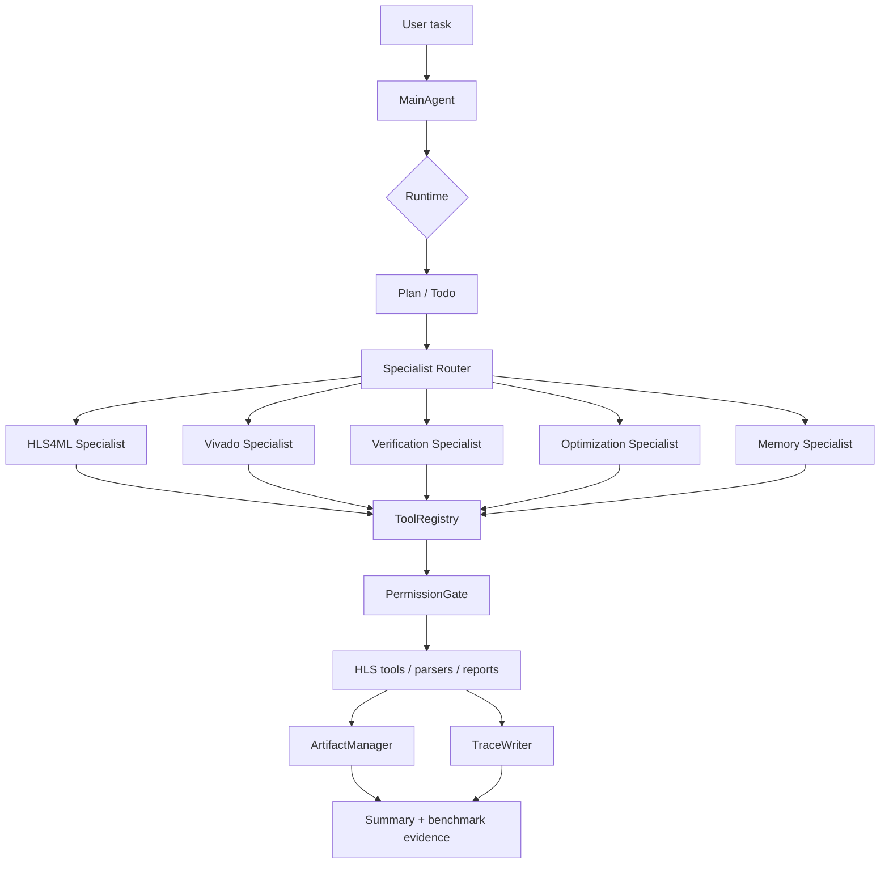
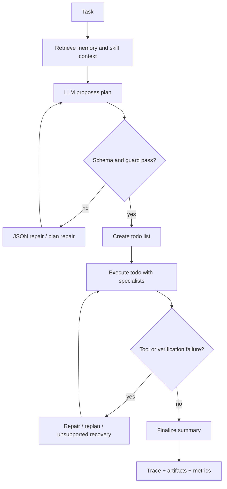
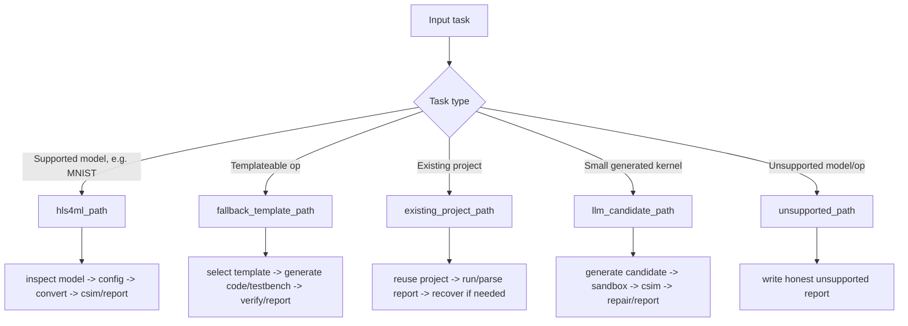
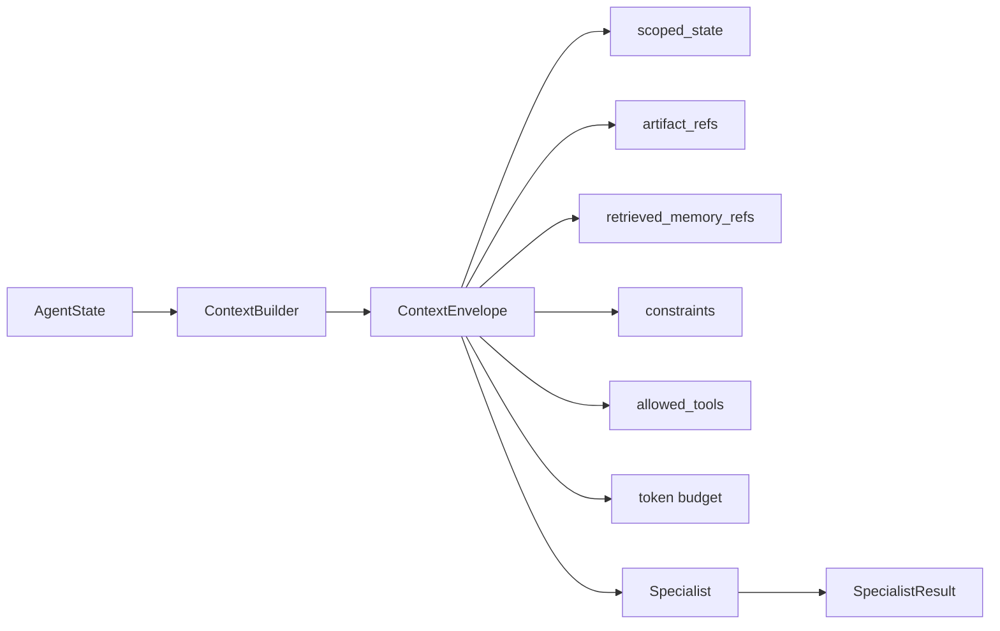
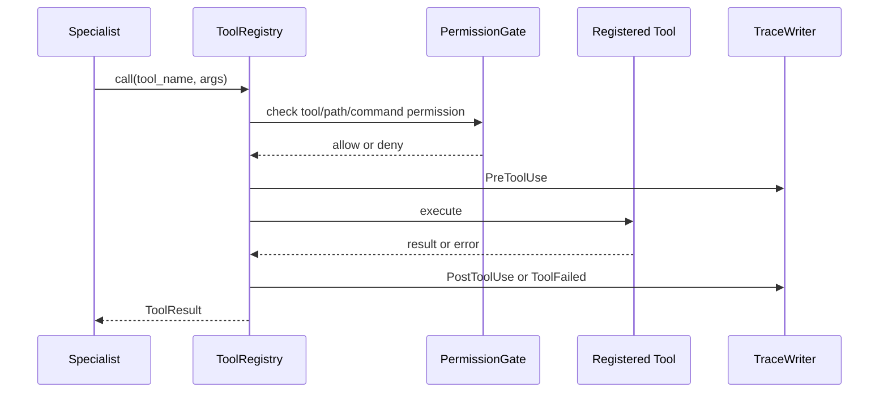
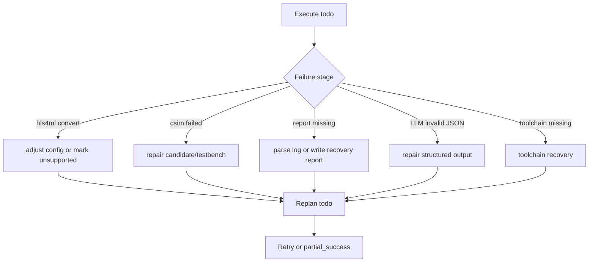
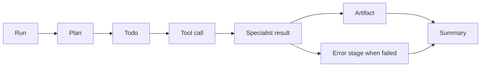
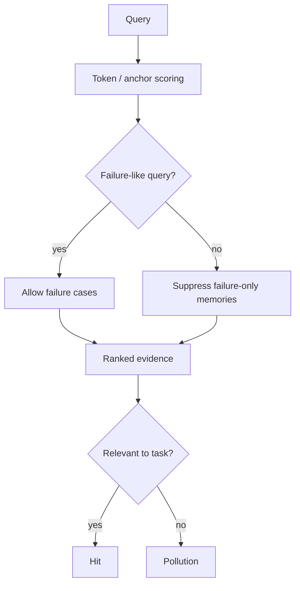
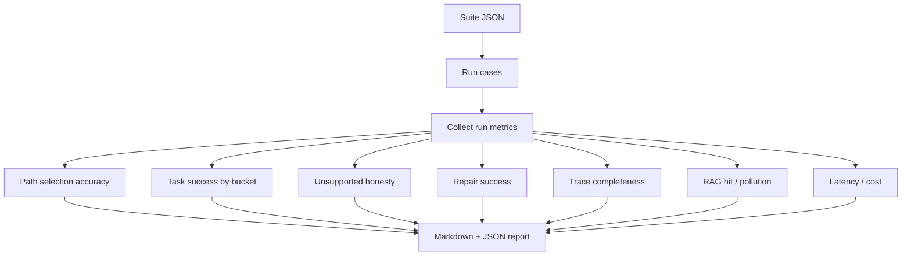
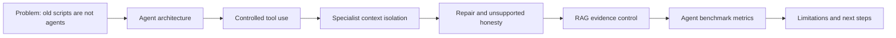

# DL-Operator-to-HLS Agent 工作流图

本文档用于面试时快速展示系统结构。图中的重点是 Agent Harness，而不是硬件指标。

## 1. 总体架构

## 2. LLM-first Harness

## 3. Path Selection

## 4. Specialist Context

## 5. Tool Call Safety

## 6. Repair Loop

## 7. Trace Completeness

## 8. RAG Evidence Control

## 9. Benchmark Harness

## 10. 面试讲解顺序

