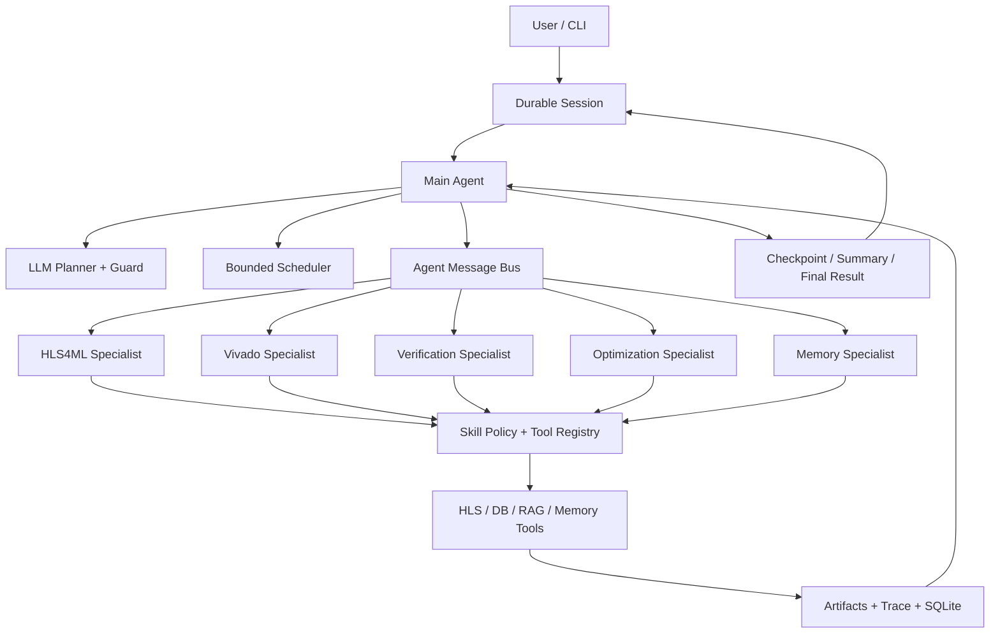
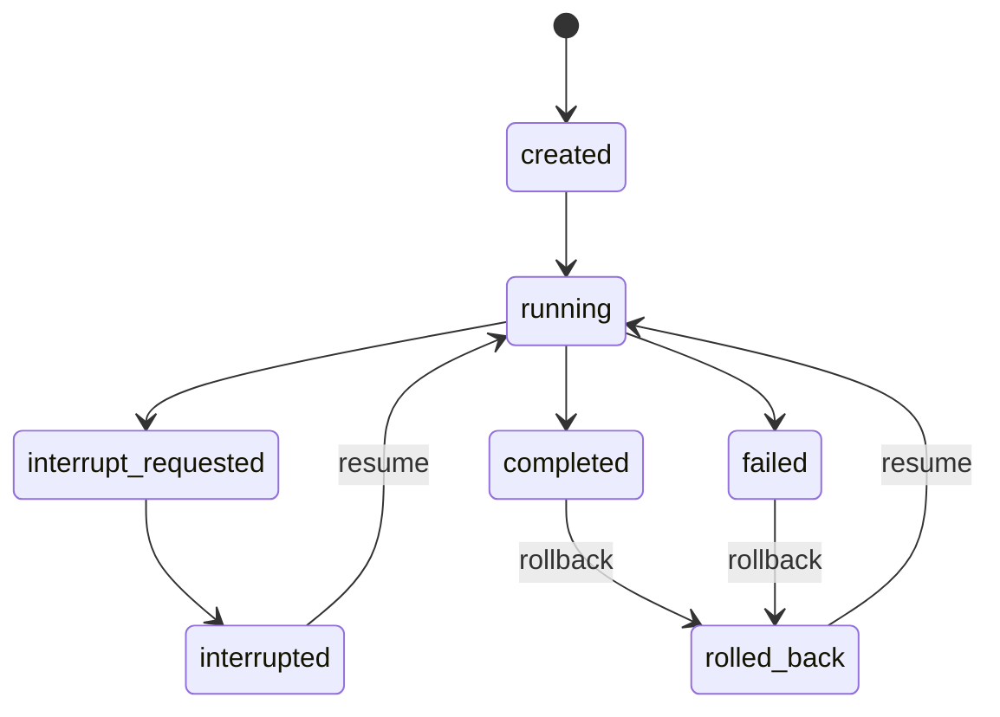

# LLM Agent Runtime V2

## 定位

项目主路径已经从“固定流程加少量 LLM”调整为“LLM 决策、确定性 Harness 约束、工具执行提供事实”。LLM 负责理解自然语言、选择 Skill、生成和修复计划、局部 ReAct 与反思；Harness 负责状态、权限、预算、调度、验证和可恢复性。确定性流程只通过 `run-baseline` 保留，用于回归和消融对照。

## 架构



Main Agent 是唯一全局状态所有者，负责计划、Todo DAG、调度、合并和最终诚实性。Specialist 只看到裁剪后的 `ContextEnvelope` 和自己的工具集合，只返回结构化 `SpecialistResult`，不能直接改写全局 `AgentState` 或长期记忆。

Main Agent 与 Specialist 之间通过 `delegation_request` 和 `delegation_result` 通信。消息带 `message_id`、`correlation_id`、sender、recipient 和 parent message，并持久化到每个 run 的 `agent_messages.jsonl`，因此可以评测委派是否闭环。

## 会话状态机

持久化会话位于 `runs/sessions/<session_id>`，包含会话记录、事件流和不可变 checkpoint。



- 中断：`session-interrupt` 设置 cooperative cancellation token。Runtime 在工具调用前和 Todo 边界检查，保存 checkpoint 后停止。
- 恢复：`session-resume` 从 active checkpoint 重建 `AgentState`、TodoList、router 和 executor；中断时处于 `in_progress` 的 Todo 会回到 `pending`。
- 回滚：`session-rollback` 移动 active checkpoint 并递增 generation，保留旧 checkpoint 和事件，避免破坏审计链。
- 撤回：`session-retract` 对最后一条有效用户消息做逻辑撤回，不物理删除历史记录。
- 追问：相同 session 的新输入会携带上一任务、会话摘要和最近消息，由 Task Interpreter 生成完整任务，而不是只返回 delta。
- 审批：PermissionGate 返回 `ask` 时创建按 tool name 和 arguments hash 绑定的 approval。批准或拒绝后从 checkpoint 恢复，防止审批被复用于不同参数。

当前中断是协作式边界中断。已经进入外部 EDA 子进程的单次调用不会被强制杀死；它会在工具返回后的下一个边界停止。该限制在长程评测和面试陈述中必须如实说明。

## 规划与调度

Runtime 使用全局 Plan/Todo DAG 和局部 ReAct：

1. Task Interpreter 把文件、结构化 JSON 或自然语言转换为完整任务。
2. Planner 只看到 Main Agent 层能力、Specialist 能力和工具契约，不看到不属于当前层的私有工具。
3. Guard 校验工具存在性、层级归属、Specialist 路由和 Skill policy。非法计划最多修复一次，然后显式失败。
4. Main Agent 按依赖选择 ready Todo，通过消息总线委派 Specialist。
5. Specialist 在本地上下文中选择工具，工具结果经 `SpecialistResult` 压缩后合并。
6. Reflector 根据真实 observation 决定完成、repair、replan、partial success 或 unsupported。

并行策略采用小型有界线程池，默认最多 2 个 tool worker。仅并行无依赖、只读、标记为 `parallel_safe` 的检索工作；LLM 调用并发固定为 1；Todo 状态变更、artifact 注册、DB 写入和 Specialist result merge 串行执行。这样保留大部分 I/O 收益，同时避免并发 prompt、重复请求和状态竞态。

## Tool 与 Skill

Tool 是原子执行边界。每个 `ToolSpec` 声明：

- name、description、permission level 和 ownership tags
- input/output JSON Schema
- idempotent、cacheable、parallel_safe、max_retries

`ToolRegistry` 统一执行 schema validation、permission/approval、run budget、per-run cache、幂等 retry、trace 和 structured error。只有显式标记 cacheable 的只读工具复用结果；写工具不缓存，避免隐藏副作用。

Skill 是可审计的流程策略，不是直接拼接 prompt 的模板。Skill 声明 version、approved/draft status、allowed tools、allowed specialists、verification rules、max steps、context policy、budget policy 和 concurrency policy。只有 approved Skill 能执行，LLM 生成的计划必须同时通过 SkillPolicy 与 LLMGuard。

## 上下文与记忆

- L0 Runtime State：当前 task、Todo、artifact 引用、错误和结构化结果。
- L1 Short-term：当前 run 的压缩 observation、近期决策和错误摘要。
- L2 Episodic：历史 run、实现、综合和失败事实，保存在 SQLite。
- L3 Semantic：跨 run 提炼的验证事实和经验。
- L4 Skill/Playbook：经过批准的可执行流程。

原始日志、代码和 report 保存在 artifact，prompt 只接收有优先级和 token 上限的摘要。`ContextWindowManager` 对 memory 和 observation 去重、按相关性排序并截断；会话消息保留最近窗口，旧消息滚动压缩为摘要。长期记忆写入需要验证状态和 promotion gate，避免失败猜测变成事实。

## RAG

RAG 使用 SQLite FTS5 与词法匹配的混合检索，并保留 source id、source type、created_at、trust 和 retrieval score。排序同时考虑全文相关性、词法命中、来源可信度、curated playbook 提升和 source diversity。Indexer 批量写入并按 source/chunk 去重。

RAG 结果只是 evidence，不是事实覆盖层。当前 task 和真实工具 report 优先级始终高于历史经验。评测同时报告 evidence hit、pollution、MRR、Recall@K、source diversity 和 provenance completeness。

## 性能与预算

每个 run 共享线程安全 `RunBudget`：

- `DL_OP_TO_HLS_MAX_LLM_CALLS`
- `DL_OP_TO_HLS_MAX_TOOL_CALLS`
- `DL_OP_TO_HLS_LLM_MAX_TOTAL_TOKENS`
- `DL_OP_TO_HLS_MAX_PARALLEL_TOOLS`，默认 2

LLM provider 返回 usage 时记录真实 input/output tokens，否则使用保守估算。Runtime 还记录 tool calls、LLM calls、cache hit、duplicate call、p50/p95 runtime 和预算超限。Specialist LLM 默认 `adaptive`：已由计划明确工具和参数时不重复调用 LLM，只在歧义、失败修复或无首选工具时启用局部 decider。

## 安全与完整性

- 所有外部动作必须经过 ToolRegistry，禁止 Agent 绕过工具层。
- schema、层级 ownership、Skill allowlist 和 PermissionGate 形成四层 guard。
- 高风险动作使用可恢复 HITL approval，不使用永久性隐式授权。
- LLM candidate 必须经过 functional verification；未验证结果不能写成成功实现。
- unsupported path 不得生成伪造 latency、resource 或 verification 结论。
- trace、agent messages、checkpoint、artifact manifest 和 structured error 共同形成审计链。

## 评测

默认 benchmark runner 是 `llm`。`benchmarks/llm_agent_harness_suite.json` 用于 LLM Harness 回归，MNIST 是真实主路径，其他 case 用于路由、边界和 repair 压测。

核心指标包括：

- path/tool selection accuracy 与分桶 task success
- unsupported honesty 与 verification grounding
- planning acceptance、guard rejection、JSON/tool repair、replan success
- trace/artifact completeness 和 delegation completion
- session、checkpoint、interrupt/resume/rollback contract
- tool schema rejection、permission/approval correctness
- RAG hit、pollution、MRR、Recall@K、provenance
- p50/p95 runtime、tool/LLM calls、provider tokens、duplicate calls、cache hit、budget exceeded

Suite case 可以声明 `require_session`、`min_checkpoints`、`delegation_completion_min`、`max_duplicate_tool_call_rate`、`max_budget_exceeded`、`max_tool_schema_rejections`、`max_recorded_tokens` 和 `max_tool_calls_run`，把架构要求变成可执行验收条件。

```powershell
python -m dl_op_to_hls.cli benchmark `
  --run-suite `
  --runner llm `
  --suite-file benchmarks\llm_agent_harness_suite.json `
  --rag-eval-file benchmarks\rag_eval_labels.json `
  --output runs\benchmarks\llm_agent_runtime_v2.json `
  --quiet
```

真实 LLM 与 Vivado 重复评测成本较高，应至少重复 3 次后报告均值与 p50/p95，并同时公开失败样例。单次 curated suite 的 1.0 只能说明契约回归通过，不能声明开放域泛化。
