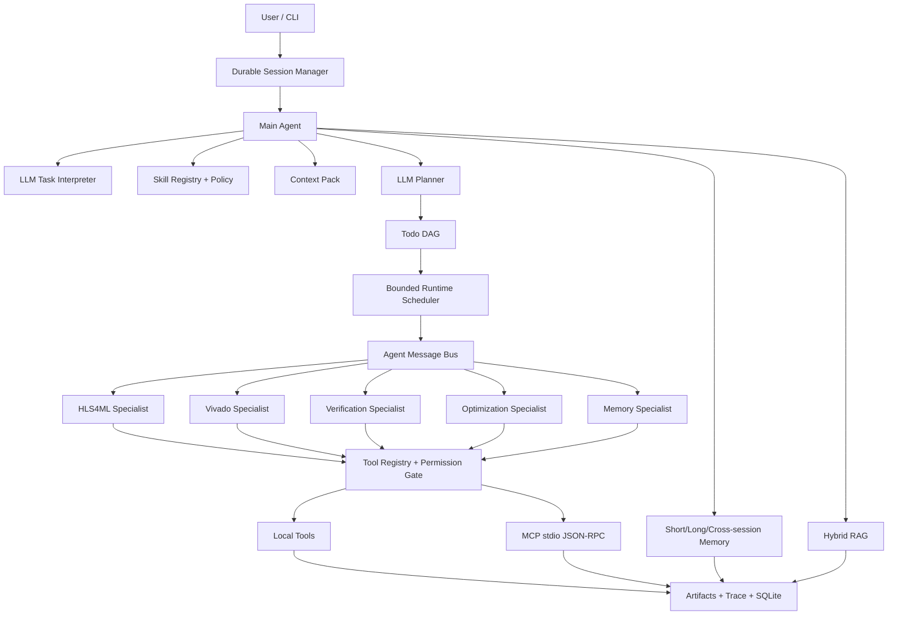
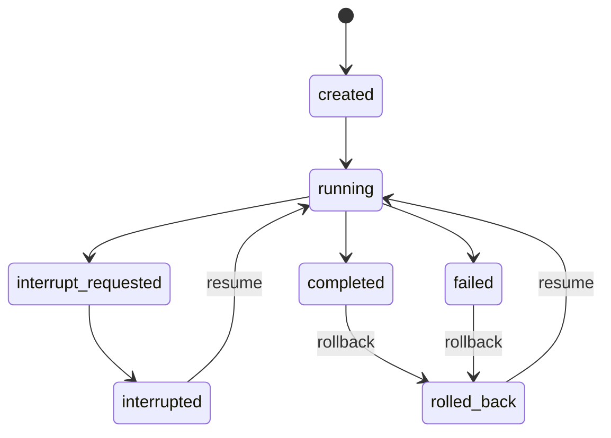
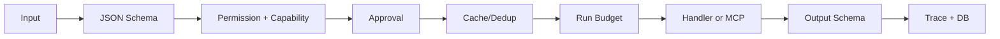

# DL-Operator-to-HLS Agent 成熟 LLM Agent 架构与实现

## 1. 文档定位

本文描述当前仓库中已经实现的 LLM Agent Harness，而不是硬件性能评测方法。硬件工具链是 Agent 操作的领域环境；系统重点是规划、调度、工具治理、上下文、记忆、RAG、会话、恢复、权限和评测。

当前实现定位为“生产级本地 Agent Harness”：支持受控 Sub Agent、真实 LLM/MCP、可恢复会话、SQLite lease durable queue、exactly-once state commit、容器执行策略和可审计执行。它不是多租户云控制面；共享数据库/队列、远程 MCP OAuth、KMS、容器编排和多机容灾仍应由部署平台提供。

## 2. 设计目标

1. LLM 负责语义理解、Skill 选择、Todo 规划、ReAct 决策和失败反思。
2. Harness 负责权限、预算、Schema、状态机、并发、检查点、可观测性和结果真实性。
3. Main Agent 只做全局规划、委派、合并和终止判断；领域执行交给 Specialist。
4. 工具返回值不被默认信任，输入和输出都必须通过结构校验。
5. 不支持或未验证的任务不得伪造 latency、resource 或 verification 结果。
6. 上下文、并发和调用次数都受显式预算约束，避免重复 LLM 请求。
7. 记忆和 RAG 必须有来源、命名空间、可信度和污染控制。
8. 所有关键决策都能从 trace、artifact、session 和 SQLite 元数据中复盘。

## 3. 总体架构



主要入口：

- `src/dl_op_to_hls/main_agent/llm_runtime.py`：LLM-first 生命周期。
- `src/dl_op_to_hls/main_agent/runtime.py`：Plan/Execute/ReAct、委派和合并。
- `src/dl_op_to_hls/main_agent/agent.py`：依赖装配、工具注册和 run context。
- `src/dl_op_to_hls/core/tool_registry.py`：统一工具 Harness。
- `src/dl_op_to_hls/specialists/`：Sub Agent 实现。

## 4. Main Agent 与 Sub Agent

### 4.1 Main Agent 职责

Main Agent 负责将自然语言或任务文件解释为 Task Schema、检索候选 Skill、生成 Todo DAG、委派、合并 SpecialistResult、repair/replan、停止判断和持久化。Main Agent 不直接拥有 Specialist 私有工具。

LLM 计划中的 `assigned_tool` 和 `assigned_specialist` 必须同时通过 Skill allowlist、Planner Guard 和 Specialist allowlist。

### 4.2 Sub Agent 契约

每个 Specialist 声明 `name`、`description`、`allowed_tools`、`can_handle(todo)` 和 `handle(ContextEnvelope, ToolRegistry, PermissionGate)`。

输入是裁剪后的 `ContextEnvelope`，输出是统一 `SpecialistResult`，包含 status、summary、metrics、artifacts、errors、warnings、verification、suggested_todos 和 context_usage。

Main Agent 与 Specialist 通过 `AgentMessageBus` 写入 `agent_messages.jsonl`。委派请求和结果使用 `correlation_id`、`parent_message_id` 配对，评测会计算 delegation completion rate。

### 4.3 能力隔离

Specialist 调用工具时，`BaseSpecialist` 创建独立 principal，例如：

```json
{
  "type": "specialist",
  "id": "VivadoSpecialist",
  "capabilities": ["hls.inspect", "hls.execute"]
}
```

权限判断同时检查 Todo 的 allowed_tools、Specialist allowed_tools、ToolSpec required_capabilities，以及文件、命令、网络和风险策略。

## 5. 会话、断点和撤回

`SessionManager` 使用数据库作为权威状态源。`agent_sessions` 保存 thread 状态、generation、active checkpoint、单调序号和 CAS version；messages、events、checkpoints、approvals 分别使用规范化表。MainAgent 与 durable queue 共享同一个 `Database` 实例，其他本地 Worker 能立即看到已提交状态。

每次状态转换都使用短事务：状态与事件、checkpoint 与 active pointer、审批消费与审计记录原子提交。外部工具调用不持有事务。checkpoint 是不可变快照并保存 parent、runtime 和 state hash；rollback 只移动 active pointer 并递增 generation。

`session.json`、`events.jsonl` 和 `checkpoints/cp_*.json` 仍会生成，但只是可重建审计 projection，不参与并发控制。projection 损坏不会污染数据库。SQLite WAL 满足本机多 Worker；多机部署应保持相同 thread/checkpoint 契约并替换为 PostgreSQL 等共享 backend。



### 5.1 主动中断与恢复

`session-interrupt` 持久化 `interrupt_requested`。CancellationToken 在 Todo 边界和工具调用前检查中断，当前状态随后写入 checkpoint。恢复时重新加载 AgentState、TodoList、RunBudget 和选中的 Skill，不重做已完成 Todo。

### 5.2 回滚

`session-rollback` 选择指定 checkpoint 或向前 N 步，更新 active checkpoint 并递增 generation。旧 artifact 不删除，因此审计历史仍然存在。

### 5.3 消息撤回

`session-retract` 撤回最近一个有效 user turn，并级联撤回其后的 assistant/system 消息。会话递增 generation、清除旧 summary、标记 `replan_required`，并拒绝从旧计划直接 resume。以同一个 session_id 提交替代输入后，系统创建新计划。

### 5.4 审批

高风险工具或 `ask` 命令生成 approval request。审批绑定 `session_id + tool_name + args_hash`，并具有 expires_at、max_uses、use_count 以及 approved/rejected/expired/consumed 状态，不能被其他参数或会话复用。

审批状态判断和单次消费在数据库事务内完成。两个 Worker 同时尝试消费 `max_uses=1` 的审批时只有一个成功，并生成 `SessionApprovalConsumed` 事件。

## 6. 多文档和多代码文件上下文

`WorkspaceContext` 位于 `src/dl_op_to_hls/core/workspace_context.py`。

### 6.1 增量索引

- 扫描 Python、C/C++、Markdown、JSON、YAML、TCL 和文本文件。
- 默认忽略 `.git`、虚拟环境、缓存、`node_modules` 和 `runs`。
- 保存 SHA-256、大小、行数、语言和 symbols。
- 未变化文件复用 manifest；删除文件从 manifest 移除。
- 文件大小有上限，扫描前经过 PermissionGate。

索引写入 `runs/workspace_index.json`，不会把整个代码库塞入 LLM prompt。

### 6.2 结构提取和工具

Python 使用 AST 提取 class/function 和行范围；C/C++ 提取函数签名；Markdown 提取标题。

- `workspace.scan`：增量建立索引。
- `workspace.search`：检索并返回上下文行。
- `workspace.symbol_search`：按 symbol/kind 检索。
- `workspace.read_batch`：一次读取多个文件的有限行区间。

结果使用 `path:Lstart-Lend` citation。批量读取有总字符预算，减少工具往返和 token 消耗。所有正式 Skill 显式声明这些 workspace 工具，LLM Planner 可以将其编入 Todo。

## 7. 自动上下文压缩

### 7.1 Context Pack

`ContextPack` 将输入分为 pinned task/constraints、Skill/tool contracts、workspace evidence、memory/RAG evidence、state 和 observations。每个 block 有 category、priority、pinned、source 和稳定 block_id。

编译过程执行：pinned 优先、内容哈希去重、低优先级按预算裁剪、根据 query 做句子级 extractive compression，并生成 token ledger 与 dropped reason。

Planner 和 ReAct 写 `ContextPackBuilt` trace，记录 token_budget、estimated_tokens、pinned_tokens 和 dropped_blocks，可直接评测是否超预算以及关键约束是否丢失。

### 7.2 Specialist ContextEnvelope

ContextBuilder 为每个 Specialist 只提供它负责的 Todo、允许工具、状态摘要、artifact refs 和检索记忆。大 artifact 默认只传引用。`TokenBudgetManager` 依次压缩 RAG、memory、state、notes，最后才进行通用字符串裁剪。

### 7.3 会话压缩

会话保留最近消息，旧消息通过 ContextPack 做 query-aware 摘要。`compaction_history` 保存被压缩 message_id 和 ledger；被撤回消息不参与压缩。

## 8. 权限与资源治理

`PermissionGate` 是 ToolSpec-aware policy engine。

### 8.1 文件权限

- read/write 根目录分别配置，denied_dirs 优先。
- 使用 resolve 后绝对路径阻止 `..` 和 symlink 越界。
- 递归检查嵌套 object/array 参数。
- Tool Schema 支持 `x-permission: read_path|write_path|command|url`。
- 没有 annotation 时根据 `_path`、`_dir`、`command`、`base_url` 等键保守推断。

### 8.2 命令、网络和能力

- 命令使用 allow/ask/deny，默认未列出即拒绝。
- 网络检查 scheme 和精确/子域 allowlist；localhost 和云 metadata 地址默认拒绝。
- LLMClient 在真正发 HTTP 请求前检查 provider base_url。
- ToolSpec 支持 required_capabilities、risk_level、timeout_seconds、network_domains、idempotent、cacheable、parallel_safe 和 max_retries。
- 参数大小受 `max_tool_argument_bytes` 限制。

通用 Tool timeout 是 Harness 的超时检测；需要强制终止的外部命令应由 adapter/MCP server 使用可取消子进程实现。

## 9. Tool Harness



- 输入/输出双向 JSON Schema 校验。
- 缓存键为 `tool_name + args_hash`。
- 只对 idempotent 工具自动 retry。
- Main Agent、Specialist 和 Tool 共享 RunBudget。
- cancellation、permission、approval、schema、retry、cache 和 failure 均有 trace。
- DB 保存 server、transport、duration、status 和输入输出哈希，不保存 API key。

## 10. Skill SDK 与生命周期

Skill 包含 identity、trigger、安全 condition DSL、preconditions、Todo DAG、allowed tools/specialists、artifact contract、failure/verification/memory policy、context/budget/concurrency policy、dependencies、permissions、tests 和可选 integrity.sha256。

`SkillValidator` 检查必填字段、语义版本、Todo id、未知依赖、DAG 环、allowlist、正数预算、并发上限、risk level、dependency 格式和完整性哈希。Condition DSL 只支持 field path 与 `eq/ne/in/contains/exists`，不执行 Python `eval`。

状态为 candidate、approved、deprecated。只有 approved Skill 进入 Planner。合法转换：candidate -> approved/deprecated，approved -> deprecated。Registry 支持同名多版本，执行时优先最新 approved。

CLI 提供 `skills-validate`、`skill-promote`、`skill-deprecate`。Skill 选中后，RunBudget 和 Scheduler 只能收紧；max_steps、context_policy 和 repair allowlist 在运行时执行。

## 11. MCP 接入

`src/dl_op_to_hls/mcp/` 实现真实 JSON-RPC 2.0 stdio transport。

### 11.1 Server

支持 `initialize`、`ping`、`tools/list`、`tools/call`、`resources/list` 和 `prompts/list`。`serve-hls4ml` 与 `serve-vivado-hls` 启动协议 server，stdout 只输出 JSON-RPC。

### 11.2 Client 和代理

`StdioMCPClient` 负责 child process、request id、并发 pending queue、协议协商、timeout、单次 reconnect、graceful terminate/kill fallback，以及 Windows `CREATE_NO_WINDOW`。默认不向 MCP 子进程继承 LLM API key。

设置 `DL_OP_TO_HLS_MCP_TRANSPORT=stdio` 后，MainAgent 从远端 `tools/list` 建立代理 ToolSpec。代理仍经过本地 Schema、PermissionGate、approval、budget、cache 和 trace，不会绕过 Harness。

当前 transport 是 stdio。远程 Streamable HTTP、OAuth 和 server discovery 是部署层扩展点，未伪装成已实现能力。

## 12. 长短期与跨会话记忆

### 12.1 分层和命名空间

- Run short-term：文件和 SQLite `scope=run`。
- Compressed run context：错误、状态和关键结果摘要。
- Long-term episodic/semantic/implementation/failure/optimization/skill memory。
- Cross-session conversation：用户偏好和会话摘要。

memory_items 包含 namespace、user_id、project_id、session_id：global 可共享，project 同项目共享，user 同用户跨会话共享，session 仅当前会话。查询按身份过滤，避免用户或项目串数据。

### 12.2 治理

- content_hash 去重；
- expires_at 和 cleanup；
- supersedes_id 和 superseded 状态；
- access_count/last_accessed_at；
- feedback_score；
- soft delete + 内容遗忘；
- verified implementation 只有功能验证成立后才以高置信度提升。

CLI 提供 `memory-feedback`、`memory-forget` 和 `memory-cleanup`。SQLite 启用 WAL、foreign_keys 和 busy_timeout。

## 13. RAG

RAG 使用“索引、召回、过滤、重排、去重、来源”分层实现。

### 13.1 索引

文本按 overlap chunk 切分，保存 chunk_index、字符偏移和起止行；SQLite 普通表与 FTS5 同步；chunk 保存 domain、memory_type、run_id、namespace 和来源。

`SemanticRagEngine` 在写入 chunk 时批量生成 normalized embedding。`rag_embeddings` 按 `(chunk_id, model_id)` 保存向量、维度、content hash 和更新时间。模型升级不会覆盖旧模型数据；content hash 不一致时只重算变更 chunk，已有向量可直接复用。

### 13.2 Embedding Recall + Cross-Encoder Rerank

查询链路为：

```text
namespace/domain filter -> embedding recall + FTS signal -> bounded candidate pool
-> entity anchor guard -> cross-encoder rerank -> dedupe/diversity
-> evidence grade/corrective retrieval -> context
```

当前默认 embedding 为 `sentence-transformers/all-MiniLM-L6-v2`，cross encoder 为 `cross-encoder/ms-marco-MiniLM-L-6-v2`，只对最多 32 个候选执行昂贵 rerank。Embedding、query 和 query-document pair 都有有界 LRU cache；模型按进程 lazy-load 并复用。较大候选集通过持久化 FAISS HNSW 召回，并提供 pgvector 外部适配边界；精确 cosine 和 lexical retrieval 仍作为降级路径。

Cross encoder 不被视为绝对真值。模型名、错误、semantic score、pre-rerank rank、cross-encoder score 和 final rank 都进入 retrieval metadata。结构化错误名、模型名和带数字/下划线的任务标识通过 entity anchor guard 保持硬约束，避免通用语义模型因为“HLS/resource/reuse”等公共词把 ResNet 查询错误映射到 MatMul 经验。

模型缺失或推理失败会打开本次 Engine 的 circuit breaker；若 `allow_lexical_fallback=true`，回退到 FTS/lexical 强约束检索并记录 `lexical_fallback`，不会悄悄伪装成 semantic retrieval。生产配置使用 `local_files_only=true`，模型应作为部署制品预热，避免运行中隐式联网。

旧数据库迁移采用有界策略：在线查询最多补算 `max_online_embeddings` 个 lexical/trust frontier chunk，避免第一次查询扫描并编码整个历史库；`rag-backfill --batch-size 256` 可离线、可恢复地补齐其余向量，并报告 model-specific coverage。本工作区现有 13,357 个 chunk 已完成 100% backfill。

每条结果包含 source_id、citation、lexical/semantic/cross-encoder/hybrid score、两阶段 rank 和 provenance。记忆写回前会删除 rag_context、retrieved_memories 和 prior experience hint，防止召回内容再次写回造成二阶污染。

## 14. 并发、性能和成本

- 默认 tool workers=2；Skill 上限不超过 8。
- LLM 默认串行，只有策略明确允许时提高。
- 初始 similar/failure/optimization/conversation memory 是独立只读调用，使用 bounded scheduler 并行。
- Todo DAG 的状态合并和 repair 默认串行，避免共享 AgentState 竞争和重复 LLM 决策。
- 只有 parallel_safe 工具适合并行批次。
- Planner/ReAct/ContextEnvelope 均有 token budget。
- RunBudget 限制 LLM calls、tool calls 和 total tokens。
- read-only/idempotent 工具有 cache 和有限 retry。
- LLM 有 min interval、bytes/minute 和 429 cooldown。
- 批量文件读取和内容哈希去重减少调用和 token。

性能目标不是最大并发，而是在依赖、状态一致性和 token 成本约束下缩短关键路径。

## 15. Repair、恢复与真实性

错误结构包括 error_type、message、recoverable、source、suggested_action 和 details。Reflector 可对 csim/verification、conversion、report parse、LLM JSON、candidate 和 toolchain 失败执行 repair/replan。

Unsupported honesty 规则：unsupported path 的最终状态只能是 partial_success/unsupported；不得存在合成 latency/resource；不得声称通过功能验证；summary 必须给出原因和下一步。

## 16. 可观测性

每个 run 包含 input、normalized task、plan/todos、trace、agent messages、specialist trace/summary、artifacts manifest、state、run budget、summary/suggestions 和 memory artifacts。

核心 trace 包括 LLM、Tool、Specialist、Scheduler、Permission、Approval、Context、Checkpoint、Repair 和 Run 事件。参数和结果以 hash 记录，LLM debug artifact 经过 secret redaction。

## 17. Agent 评测

```powershell
dl-op-to-hls benchmark --run-suite --runner llm --suite-file benchmarks/agent_capability_suite.json --quiet
```

### 17.1 核心指标

- Tool/path selection accuracy：selected_path 工具组完整且无 forbidden tools。
- Task success rate：按 operator_fallback、model_hls4ml、unsupported_recovery、toolchain_recovery 分桶。
- Unsupported honesty rate：状态、空硬件指标和空验证声明同时成立。
- Repair success rate：存在失败 stage、发生 repair/replan 且最终成功或部分成功。
- Trace completeness：plan、todo、tool、specialist、artifact、error stage、summary。
- RAG evidence hit/pollution：相关 task anchor 命中与跨任务污染。
- Latency/cost：runtime p50/p95、tool calls/run、LLM calls/run、tokens/run、cache hit。

### 17.2 成熟度指标

`agent_maturity` 统计 durable session、checkpoint、bounded runtime、specialist protocol、Skill contract、Context Pack 数量和预算合规率、workspace calls、cross-session memory calls、permission denial/approval，以及 MCP calls/server。

独立成熟度探针覆盖正常业务 run 不一定触发的权限攻击、workspace、MCP、跨用户记忆和 RAG 隔离：

```powershell
dl-op-to-hls maturity-benchmark --output runs/benchmarks/agent_maturity_probe.json
```

权限拒绝、workspace 和 MCP 是场景型指标，不要求每个正常 run 都触发；core_score 只聚合每个 run 应具备的基础能力。

### 17.3 防止指标虚高

评测不能只包含 MNIST happy path。capability suite 同时覆盖 Dense/MatMul/ReLU/Add fallback、MNIST MLP/Tiny CNN/QONNX、existing project、custom unsupported、residual/ResNet boundary honesty 和 Vivado missing recovery。

报告必须区分 deterministic/mock 回归、real LLM Harness 评测和 real toolchain 证据。mock 高成功率只说明 Harness 回归稳定，不能冒充真实硬件结果。

## 18. 常用命令

```powershell
# 主 LLM Agent
dl-op-to-hls agent-run examples/mnist_recognition_mlp.json --user-id interview-demo --project-id mnist-agent

# 会话
dl-op-to-hls session-interrupt <session_id>
dl-op-to-hls session-resume <session_id>
dl-op-to-hls session-rollback <session_id> --steps 1
dl-op-to-hls session-retract <session_id>

# Workspace
dl-op-to-hls workspace-scan src docs skills
dl-op-to-hls workspace-search "LLMPlanAccepted"

# Skill
dl-op-to-hls skills-validate
dl-op-to-hls skill-promote <skill_name> --version 1.0.0
dl-op-to-hls skill-deprecate <skill_name> --version 1.0.0

# Memory
dl-op-to-hls memory-feedback <memory_id> 1 --reason useful
dl-op-to-hls memory-forget <memory_id>
dl-op-to-hls memory-cleanup

# MCP
$env:DL_OP_TO_HLS_MCP_TRANSPORT = "stdio"
dl-op-to-hls serve-hls4ml
```

## 19. LLM 配置与密钥

```powershell
$env:DL_OP_TO_HLS_LLM_ENABLED = "1"
$env:DL_OP_TO_HLS_LLM_PROVIDER = "openai"
$env:DL_OP_TO_HLS_LLM_BASE_URL = "https://api.deepseek.com"
$env:DL_OP_TO_HLS_LLM_MODEL = "deepseek-v4-pro"
$env:DL_OP_TO_HLS_LLM_API_KEY = "<secret>"
```

API key 不得写入任务文件、Skill、trace、benchmark report 或 Git。`permissions.yaml` 必须显式 allow-list provider domain。

## 20. 验证

专项测试覆盖增量 workspace/symbol/citation、Context Pack、nested permission、跨用户 memory isolation、Skill schema/DAG、MCP initialize/list/call 和真实 subprocess round trip，并保留原有会话、LLM Harness、RAG、benchmark 和工具链回归。

```powershell
$env:PYTHONPATH = "src"
python -m pytest -q -p no:cacheprovider --basetemp="runs/pytest_mature_agent"
```

## 21. 部署边界

以下由生产部署补齐，不在本地 Harness 中伪造：

1. 操作系统级强沙箱，例如容器、低权限账户或 AppContainer。
2. 远程 MCP Streamable HTTP、OAuth、服务发现和证书轮换。
3. 当前已实现单库多 Worker lease queue、outbox 和 exactly-once state commit；多节点生产部署仍需共享 PostgreSQL/队列、worker fencing 和企业 KMS。
4. 当前已实现 FAISS HNSW 持久索引和 pgvector adapter；百万级生产语料仍需外部数据库、分片、RLS、在线重建和容量压测。
5. 所有第三方工具的强制进程中止；通用 CancellationToken 是 cooperative，MCP client 和受控子进程提供 timeout/终止边界。

面试时应明确区分“Agent runtime 已实现能力”和“云平台基础设施责任”。

## 22. Bad Case 治理架构

Bad Case 治理采用“独立治理内核 + 嵌入现有生命周期”的方式。治理规则不写死在 Prompt 中，也不作为运行结束后的离线报告旁路存在：

- `core/goal_contract.py`、`core/tool_evidence.py`、`core/progress.py` 和 `rag/evidence.py` 是独立、无 LLM 依赖、可单元测试的治理组件。
- Goal Contract 嵌入 Planner 接口和 Todo 创建边界。
- Tool Postcondition 嵌入 Tool Registry 的输出 Schema 校验之后、状态提交之前。
- Corrective RAG 嵌入 RAG Tool 和初始 Memory Retrieval 入口。
- Progress Supervisor 嵌入每个 Todo 的 execute/reflect/checkpoint 边界。
- Completion Gate 嵌入 finalize 和异常关闭路径，LLM、Specialist 和普通状态归并代码都不能绕过。

这种分层既保留策略组件的独立性，又保证门禁会真实影响计划、上下文、状态和最终结果。

### 22.1 Goal Contract 与计划覆盖

`GoalContractBuilder` 将任务编译为不可由 LLM 降级的验收契约。默认 HLS 契约包含：

1. `task.validated`：任务 Schema 已验证。
2. `implementation.resolved`：存在具体实现路径，或产生诚实 unsupported boundary。
3. `implementation.verified`：成功路径必须有 golden/reference 功能验证。
4. `report.produced`：存在本次运行的综合报告或 unsupported report。
5. `implementation.timing`：成功路径满足目标时钟；unsupported 路径标记为不适用。
6. `run.summarized`：存在最终 summary artifact。
7. `run.no_unresolved_errors`：成功状态下没有必需执行路径上的未解决错误；建议生成、记忆、RAG、数据库等非 Goal Contract 辅助阶段失败会保留为 warning，不制造“任务本体失败”的假阴性。

任务可通过 `acceptance_criteria` 增加自定义 requirement，但不能删除默认 requirement。每项 requirement 包含 `requirement_id`、verifier、required、plan_required、accepted_tools、evidence_types 和 parameters。

Planner 的 Context Pack 将 Goal Contract 作为 pinned block。`PlanCoverageValidator` 检查每个 `plan_required` requirement 是否映射到 Todo。缺项时只从已批准 Skill 的 recommended todos 中补充必要步骤，并在覆盖完整后立即停止扩展，避免为了修计划引入无关工具和 Token 开销。无法修复的计划以 `LLMPlanRejected` 结束，不会进入执行。

每个 Todo 保存 `requirement_ids`，形成以下可追踪链路：

```text
user requirement -> Goal Contract -> Todo -> Tool/Specialist -> Evidence Receipt -> Completion Gate
```

运行产物包括 `goal_contract.json` 和 `plan_coverage.json`，Trace 包含 `PlanCoverageEvaluated`、`LLMPlanCoverageRepaired`。

### 22.2 独立 Completion Gate

`CompletionGate` 不读取 LLM 的“我已完成”表述，只读取结构化 AgentState、Todo、Verification、Report、Artifact 和 Evidence Receipt。成功条件为所有 required requirements 均满足。

错误也按 Goal Contract 归属分级：验证、实现、综合、报告等 required-path error 会阻断成功；不影响验收目标的辅助阶段 error 会进入 `warnings`，仍在 Trace 中完整保留。这样既不允许虚假成功，也不会因为可选建议服务暂时不可用而把已真实完成的核心任务误判失败。

如果执行器提前写入 `status=success`，但缺少验证、报告、时序或 summary，Gate 将状态降为 `partial_success`，并记录 `false_success_prevented=true`。unsupported 路径只有在 unsupported report 存在时才允许以 `partial_success` 正常停止。

最终结果额外区分：

- `evidence_level=real`：关键工具存在非 mock 的有效 receipt。
- `evidence_level=mock`：只证明 Harness 流程，不支持生产部署声明。
- `evidence_level=unverified`：没有关键执行证据。
- `production_ready`：Acceptance Contract 通过且 evidence level 为 real。

因此 mock run 可以作为 Harness 测试成功，但 `mock_results_cannot_support_production_claims=true`，不会被包装成真实硬件结论。运行产物为 `completion_gate.json`，Trace 事件为 `CompletionGateEvaluated`。

### 22.3 Corrective RAG

RAG 不再强制把 Top-K 填满上下文。`RAGEvidenceGrader` 对每个候选计算并记录：

- query anchor overlap；
- retrieval score 与 source trust；
- citation/provenance 是否存在；
- namespace/domain 是否已由 Retriever 隔离；
- expires_at、superseded、quarantined 状态；
- mock evidence 是否被用于真实结论；
- prompt injection marker；
- structured fact contradiction。

候选被分为 `relevant`、`ambiguous`、`irrelevant`、`contradictory` 或 `unsafe`。只有 relevant evidence 可以进入 Planner/Optimizer 上下文。

`CorrectiveRetriever` 的处理顺序为：

```text
原始查询 -> 召回 -> Evidence Grade
  -> 有可靠证据：Rerank、去重、返回
  -> 无可靠证据：保留关键 anchor 改写一次查询
  -> 仍无可靠证据：abstained=true，返回空上下文
```

错误或恶意结果进入 rejected evidence，而不是继续交给 LLM“自行判断”。`ClaimEvidenceVerifier` 对明确引用 historical/prior memory 的建议执行 claim-citation 支持检查，不受证据支持的 RAG claim 会从最终状态建议中移除。

运行产物包括 `memory/rag_evidence_report.json`、`rag_claim_verification.json`，Trace 包含 `RagEvidenceGraded`、`RagRetrieved`、`RagClaimsVerified`。

当前实现同时保留 FTS5/lexical 的可解释信号与 embedding/cross-encoder 的语义能力。模型故障会显式降级，entity anchor、Evidence Gate 和 abstention 仍作为模型之外的治理边界。

### 22.4 Tool Postcondition 与 Evidence Receipt

Tool Registry 的执行顺序为：

```text
Input Schema -> Permission/Approval -> Budget/Cache -> Tool Execution
-> Output Schema -> Semantic Postcondition -> Evidence Receipt -> State Commit
```

Schema 正确只表示 JSON 结构正确。`ToolPostconditionRegistry` 进一步检查：

- fallback 生成文件是否真实存在且位于当前 run；
- hls4ml config/project 是否存在且属于当前 run；
- Vivado success 是否存在当前 run 的 csynth report；
- report parser 的输入报告是否存在、输出是否包含 latency/resources/timing；
- candidate verification 是否真的通过 csim，并产生 csynth report；
- unsupported report 和 summary 是否真实落盘；
- Tool 输出是否包含 prompt injection 指令。

Receipt 保存 tool/args/output hash、检查项、artifact path、SHA256、mock 标记和时间。success-like 输出只要后置条件失败，就转换为可恢复的 `ToolPostconditionError`，不会缓存或提交为成功。所有 receipt 聚合写入 `tool_evidence.json`。

幂等工具才允许自动重试；非幂等工具发生超时或未知结果时保持 blocked/error，由 repair/replan 或用户审批决定，避免重复副作用。

### 22.5 Progress Supervisor

每个 Todo 完成 reflect 后，`ProgressSupervisor` 记录 state hash、tool、requirement_ids、open requirements、error signature 和连续 drift 次数。

- 相同 tool + args + error 重复 2 次：`replan`。
- 重复 3 次：`terminate`，产生 `AgentStagnationError`。
- 状态连续无变化：按相同阈值处理。
- Todo 连续无法映射到 Goal Contract：direction drift replan/terminate。
- 总步骤超过 `DL_OP_TO_HLS_MAX_AGENT_STEPS`：有界终止。

正常的 workspace、memory、RAG、summary、suggestion 和 DB 操作被标记为辅助工作；hls4ml inspect/config、Vivado create 等前置工具映射到对应 requirement，避免误判合理的准备步骤为跑偏。

Supervisor 只触发有证据的 replan/terminate，不为每一步额外调用 LLM。Reflection 已产生有效 repair todo 时继续执行；同类 repair 连续失败达到阈值后停止，避免“反思导致无限重试”。Trace 事件为 `AgentProgressEvaluated`。

### 22.6 常见 Bad Case 与处理

| Bad Case | 处理方式 | 最终状态原则 |
|---|---|---|
| 高分但错误的 RAG 文档 | anchor/trust grade，错误结果 rejected | 不注入上下文 |
| RAG 没有答案 | query rewrite 一次，然后 abstain | 不强行填 Top-K |
| RAG 文档相互矛盾 | structured fact contradiction quarantine | 不生成确定性结论 |
| RAG/Tool prompt injection | untrusted instruction scan | unsafe evidence 不执行 |
| Tool 返回假 success | semantic postcondition + receipt | 转为 ToolPostconditionError |
| Tool 返回旧报告 | current-run provenance check | 拒绝 stale artifact |
| LLM 计划遗漏步骤 | Goal coverage + bounded Skill repair | 无法修复则拒绝计划 |
| LLM 选择越权工具 | Skill/Specialist allowlist + Permission Gate | deny/approval |
| LLM 候选未经测试 | verification requirement | 不允许 success |
| Agent 写了 summary 就早停 | Completion Gate | false success 降级 |
| Agent 重复同一失败 | failure signature counter | replan 后有界终止 |
| Agent 连续执行无关工作 | requirement mapping + drift counter | replan/terminate |
| 修复耗尽 | repair budget + unsupported report | partial_success/unsupported |
| mock 结果冒充真实结果 | evidence level 和 production_ready 分离 | 禁止生产声明 |
| 长程任务被用户中断 | checkpoint + cancellation token | interrupted，可 resume |
| 旧会话撤回后继续旧计划 | generation + replan_required | 拒绝旧 checkpoint 继续 |
| 错误经验进入长期记忆 | 仅验证结果晋升、feedback/forget/quarantine | 不传播二阶污染 |

### 22.7 Bad Case 评测

专用故障注入探针覆盖 incomplete plan、bounded coverage repair、false success、unsupported honesty、重复失败循环、错误高分 RAG、prompt injection、矛盾知识、claim support gap、缺失 artifact 和 Tool fake success：

```powershell
dl-op-to-hls bad-case-benchmark --output runs/benchmarks/agent_bad_case_probe.json
```

评测应持续统计：

- False Success Rate；
- Premature Termination Rate；
- Goal/Plan Coverage Rate；
- No-progress Loop Detection Rate；
- Direction Drift Rate；
- Tool Semantic Success Rate；
- Tool False-success Block Rate；
- RAG Precision@K、Recall@K、MRR/nDCG；
- RAG Abstention Accuracy；
- Citation Coverage/Faithfulness；
- Contradiction/Injection Quarantine Rate；
- Repair success 与 repair cost；
- tokens per successful, acceptance-passing run。

普通 happy path 通过率不能替代这些指标。每轮模型、Prompt、Skill 或 Tool 变更，都应同时运行正常 Harness、Bad Case probe 和真实工具链抽样。

## 23. 进一步达到生产级成熟度

当前实现已经是完整的单机 Agent Harness，但“成熟 Agent”与“互联网规模生产平台”仍有边界。后续优先级如下：

1. **大规模向量检索**：已实现 FAISS HNSW 和 pgvector adapter；下一步是外部集群的分片、RLS、增量双写重建、召回一致性和容量压测。
2. **领域模型校准**：已加入 MNIST/HLS hard-negative 数据、污染率约束阈值校准和训练 triples 导出；领域微调仍需扩大人工复核标签集。
3. **持久化分布式 Runtime**：已实现 durable queue、lease、幂等键、outbox 和 exactly-once state commit；下一步是共享服务、跨主机 worker fencing 和故障注入。
4. **模型路由与发布治理**：已实现 Model/Prompt/Skill 不可变版本、确定性 canary、质量/成本门禁和自动回滚；下一步是 shadow traffic 与 provider failover。
5. **可观测性与 SLO**：已实现 OTLP-shaped spans 和 SLO breach report；下一步是连接远程 Collector、dashboard、alert 和 retrieval drift 时序告警。
6. **更强安全隔离**：工具权限已有 capability/approval/egress/path gate；生产环境还需要进程或容器沙箱、短期凭证代理、secret redaction、审计导出和供应链签名。
7. **在线反馈闭环**：已实现 feedback candidate、风险隔离、证据自动审批、人工复核和撤销重算；下一步是将任务重开和人工纠正转成版本化训练标签。
8. **对抗与长程评测**：继续补多轮需求变更、工具部分成功、并发取消、模型切换、RAG poisoning、超长代码库和跨天恢复；评测必须同时观察任务完成、证据真实性和成本。
9. **确定性重放**：目前 Trace 足以审计，但还需冻结模型/Prompt/Tool response、随机种子和时间依赖，支持完整 time-travel replay 与差异定位。

其中最重要的下一步不是继续增加 Sub Agent 数量，而是领域 RAG 标注集、分布式状态一致性、模型发布治理和线上 SLO。这些决定系统能否从成熟项目升级为可靠生产平台。
