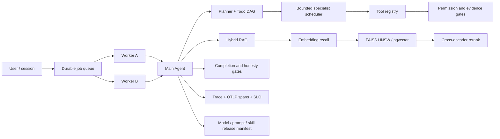

# Production LLM Agent Harness: Design and Implementation

## 1. Scope

This document describes the Agent engineering added around the MNIST-first HLS workflow. HLS is the tool environment; the primary subject is the Harness: durable execution, retrieval quality, release safety, observability, security, feedback governance, and evaluation.

The implementation is intentionally split into runtime gates instead of relying on prompt instructions. Prompts express intent. Code enforces state transitions, leases, permissions, evidence, budgets, release gates, and stopping criteria.

## 2. Runtime Architecture



Normal interactive runs remain synchronous. `agent-submit` and `worker-once` expose the same runtime through a durable work queue, so local development is simple while multi-worker semantics are testable.

## 3. Durable Sessions and Checkpoints

`core/sessions.py` uses normalized SQLite tables as the authority for sessions, messages, append-only events, immutable checkpoints, and scoped approvals. A checkpoint stores Agent state, runtime budget, parent identity, generation, and a state hash. Creating a checkpoint atomically advances the active pointer and appends an audit event; rollback moves that pointer and starts a new generation without deleting history.

Short `BEGIN IMMEDIATE` transactions and a session `version` field provide local compare-and-swap semantics. Message, event, and checkpoint sequences are allocated inside the transaction. Approval decisions bind to session, tool, and argument hash; TTL and single-use consumption are enforced transactionally across worker instances.

JSON and JSONL under `runs/sessions` are rebuildable operator projections, not a second state authority. The same contract maps naturally to a shared PostgreSQL checkpointer for multi-host deployments. This follows the thread/checkpoint pattern documented by [LangGraph persistence](https://docs.langchain.com/oss/python/langgraph/persistence) and the durable session-store boundary in the [OpenAI Agents SDK](https://openai.github.io/openai-agents-python/sessions/).

## 4. Durable Multi-worker Execution

`core/durable_queue.py` implements a SQLite WAL lease queue:

- enqueue uses a unique idempotency key;
- claim uses `BEGIN IMMEDIATE`, priority ordering, and an expiring worker lease;
- expired work is reclaimed and bounded by `max_attempts`;
- heartbeat extends a lease only for its owner;
- commit verifies lease ownership and uses compare-and-swap on `state_version`;
- `agent_state_commits.commit_key` makes state commits replayable;
- job completion and an outbox event are written in the same transaction;
- failed jobs become pending or dead according to retry policy.

This provides at-least-once job delivery and exactly-once durable state commit. External tools still need their own idempotency key or reconciliation API; the Harness does not claim exactly-once physical side effects.

## 5. Model, Prompt, and Skill Releases

`core/release_governance.py` stores immutable releases for three component types: `model`, `prompt`, and `skill`. Every run resolves a deterministic release bundle from its run ID and stores it in `AgentState.release_manifest`.

Canary routing is stable: a SHA-256 cohort maps a run to baseline or candidate, so retries do not silently change versions. Evaluation gates compare:

- task success rate;
- false-success rate;
- RAG pollution rate;
- tokens per successful task;
- p95 runtime.

Any safety or regression breach atomically rolls the candidate back. Passing all gates promotes it to baseline. The previous baseline remains registered for audit and rollback.

## 6. Retrieval at Scale

The retrieval pipeline is:

1. namespace/domain/entity filtering;
2. embedding recall with `all-MiniLM-L6-v2`;
3. FAISS HNSW ANN for larger candidate sets;
4. cross-encoder reranking with `ms-marco-MiniLM-L-6-v2`;
5. provenance, trust, and evidence grading;
6. corrective retrieval or abstention when evidence is weak or contradictory.

`rag/vector_index.py` persists an `IndexHNSWFlat` wrapped by `IndexIDMap2`, using SQLite chunk IDs as stable vector IDs. A manifest binds the index to the embedding model and content hashes; a mismatch causes rebuild instead of stale-vector reuse. Filtered retrieval over-fetches ANN neighbors and intersects them with permitted rows, preserving tenant/domain isolation. Exact cosine and lexical retrieval remain degradation paths.

`PgVectorIndex` provides the external-database boundary for a larger deployment. Pooling, migrations, tenant row-level security, and credentials stay with the deployment platform.

## 7. HLS Hard-negative Calibration

`benchmarks/hls_reranker_hard_negatives.json` contains MNIST/HLS confounders that look semantically similar but require different actions: csim versus csynth, Vivado discovery versus report parsing, QKeras versus ONNX, existing-project versus fresh conversion, unsupported honesty, and stale evidence.

`rag/calibration.py` evaluates pairwise accuracy, MRR, top-1 accuracy, precision, recall, F1, and pollution rate. It selects a decision threshold subject to a maximum pollution constraint and records dataset/model hashes. It can export query-positive-negative triples for later domain fine-tuning. Calibration is implemented now; fine-tuning is deliberately a separate offline job because it needs a larger reviewed label set.

## 8. Online Feedback Anti-pollution

Untrusted feedback is not written directly into retrieval scores. `FeedbackGovernor` first creates a candidate in one of these states:

- `pending`: no obvious risk, awaiting evidence or review;
- `quarantined`: prompt injection, cross-tenant provenance, invalid hashes, or extreme unverified scores;
- `approved`: applied to the aggregate memory score;
- `rejected` or `revoked`: excluded and auditable.

Only verified run evidence can auto-approve. Manual review is required otherwise. Revocation deletes the applied label and recomputes the aggregate. Candidate text is never inserted into RAG, preventing second-order prompt injection through the feedback channel.

The legacy trusted `add_feedback` API remains for internal benchmark labels. User-facing `memory-feedback` now uses the governed path.

## 9. Observability and SLO

`TelemetryHook` converts existing Hook events into OpenTelemetry SDK spans for runs, LLM calls, tools, and specialists. When `OTEL_EXPORTER_OTLP_ENDPOINT` is set and the exporter extra is installed, spans are batch-exported through OTLP/HTTP. It also writes dependency-free OTLP-shaped JSONL with trace IDs, span IDs, nanosecond timestamps, durations, status, and bounded attributes. The normal `trace.jsonl` remains the detailed Agent audit log; `otel_spans.jsonl` is the operational view and offline fallback.

`SLOEvaluator` checks task success, false success, RAG pollution, p95 runtime, tokens per success, and queue lease expiry rate. Reports list each target and breach. The `observability` optional dependency allows a deployment to connect the same instrumentation boundary to the OpenTelemetry SDK/exporters.

## 10. Sandbox and Credentials

Two layers protect tool execution:

- the existing candidate scanner rejects dangerous generated C/C++ constructs before execution;
- `ContainerSandbox` builds a Docker/Podman command with read-only root, all capabilities dropped, `no-new-privileges`, no network by default, bounded CPU/memory/PIDs, a restricted tmpfs, read-only workspace mount, and a run-scoped write mount.

Environment variables are allowlisted, so API keys cannot be copied into candidate containers by default.

`CredentialBroker` issues opaque, run-bound, audience-bound, scope-bound leases. Only token hashes, TTL, scope, and use counters are durable. Plaintext provider secrets are fetched at consumption time, returned once to the trusted adapter, and never stored in Agent state, trace, queue payload, or SQLite.

## 11. Token and Performance Controls

The Harness limits parallelism to two tool workers and one LLM call, deduplicates tool results, caches embeddings/reranker pairs, caps online embedding migration, compresses context at checkpoints, and avoids an LLM call when a validated plan already names an atomic tool or specialist. Durable retries resume pinned state and release versions instead of replaying the whole conversation.

ANN improves corpus scaling, but cross-encoder work remains bounded by the candidate pool. Release gates include tokens per success rather than raw tokens per run, discouraging cheap early stopping that merely lowers cost by failing tasks.

## 12. Evaluation

The maturity benchmark now covers shared database session authority, transactional single-use approvals, durable commits, canary rollback, telemetry, SLO breach detection, feedback quarantine, scoped credentials, container policy, hard-negative data, and FAISS HNSW in addition to permissions, MCP, context packing, memory, and semantic RAG.

```powershell
$env:PYTHONPATH = "src"
python -m dl_op_to_hls.cli maturity-benchmark
python -m dl_op_to_hls.cli rag-calibrate
python -m dl_op_to_hls.cli benchmark --run-suite --suite-file benchmarks\llm_agent_harness_suite.json --runner llm
```

The LLM suite measures path/tool selection, task completion, unsupported honesty, repair success, trace completeness, RAG hit/pollution, latency, tool/LLM calls, and token use. MNIST remains the primary real-tool task; hard negatives and forced failures prevent a smoke test from producing misleadingly perfect Agent scores.

## 13. CLI Operations

```text
agent-submit / worker-once / job-show
release-register / release-canary / release-evaluate / release-status
rag-backfill / rag-calibrate
memory-feedback / memory-feedback-review / memory-feedback-list
slo-evaluate
```

## 14. Honest Boundaries

The repository demonstrates the control-plane semantics locally. A real multi-host deployment still needs a shared PostgreSQL/queue service, worker identity, Kubernetes or another container runtime, an external KMS/secret manager, remote OTLP collector, dashboards, alerts, and operational load testing. The pgvector adapter is present, but no external cluster is bundled. Reranker calibration is real; domain training should wait for more reviewed labels.

These boundaries are intentional interview talking points: the project shows where correctness belongs in the Harness and where infrastructure ownership begins, without pretending that a single-machine prototype is an internet-scale service.

## 14. Verified Results (2026-08-11)

| Evaluation | Result | Interpretation |
|---|---:|---|
| Full pytest suite | 372 passed | Regression and component contracts |
| Maturity probe v3 | 33/33 | Capability wiring smoke probe, not a quality score |
| DeepSeek LLM fallback case | 1/1, score 1.0 | Real `deepseek-v4-pro` planning; correct path and Skill |
| DeepSeek LLM cost | 1 LLM call / 11,739 tokens | 32 tool calls, 306 s wall time; single-case smoke only |
| Real semantic RAG probe | 7/7, 12.89 s | Local embedding and cross-encoder path worked without fallback |
| HLS hard-negative set | 12 cases / 36 pairs | MNIST/HLS domain confounders |
| Reranker pairwise accuracy | 0.9583 | One hard-negative ordering failure remains visible |
| Reranker MRR / top-1 | 0.9583 / 0.9167 | More realistic than a perfect smoke metric |
| Calibrated precision / recall / F1 | 0.9091 / 0.8333 / 0.8696 | Threshold selected under pollution constraint |
| Calibrated pollution rate | 0.0417 | Below configured 0.05 maximum |
| FAISS production corpus probe | 13,357 vectors | 512 ANN neighbors over 13,954 filtered candidates |

The 33/33 and 7/7 results only prove that deterministic contracts and focused happy paths are wired correctly. The hard-negative reranker result is the more informative quality signal: it is deliberately non-perfect and exposes the stale-report confusion case for future labeling or domain fine-tuning.
